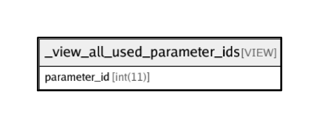

# _view_all_used_parameter_ids

## Description

VIEW

<details>
<summary><strong>Table Definition</strong></summary>

```sql
CREATE VIEW _view_all_used_parameter_ids AS (select distinct `transaction_framework`.`request_structure`.`parameter_id` AS `parameter_id` from `transaction_framework`.`request_structure` union select distinct `transaction_framework`.`response_structure`.`parameter_id` AS `parameter_id` from `transaction_framework`.`response_structure` union select distinct `transaction_framework`.`response_parameter_groups`.`member_parameter_id` AS `member_parameter_id` from `transaction_framework`.`response_parameter_groups` union select distinct `transaction_framework`.`interaction_chain_input_parameters`.`parameter_id` AS `parameter_id` from `transaction_framework`.`interaction_chain_input_parameters`)
```

</details>

## Columns

| Name | Type | Default | Nullable | Children | Parents | Comment |
| ---- | ---- | ------- | -------- | -------- | ------- | ------- |
| parameter_id | int(11) |  | false |  |  |  |

## Relations



---

> Generated by [tbls](https://github.com/k1LoW/tbls)
