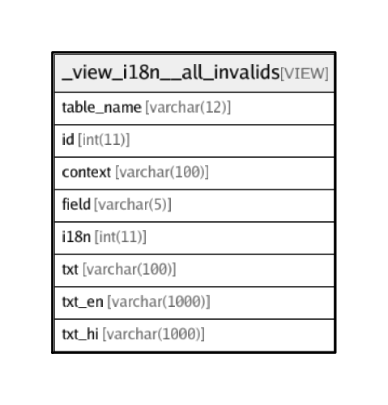

# _view_i18n__all_invalids

## Description

VIEW

<details>
<summary><strong>Table Definition</strong></summary>

```sql
CREATE VIEW _view_i18n__all_invalids AS (select 'interactions' AS `table_name`,`t`.`id` AS `id`,(`t`.`label` collate utf8_general_ci) AS `context`,'label' AS `field`,`l`.`id` AS `i18n`,(`t`.`label` collate utf8_general_ci) AS `txt`,`l`.`en` AS `txt_en`,`l`.`hi` AS `txt_hi` from (`transaction_framework`.`interactions` `t` left join `transaction_framework`.`i18n_lang_strings` `l` on((`t`.`label_i18n` = `l`.`id`))) where (((length(coalesce(`t`.`label`,'')) > 0) and isnull(`l`.`id`)) or ((`l`.`en` is not null) and (`t`.`label` <> `l`.`en`))) union select 'interactions' AS `table_name`,`t`.`id` AS `id`,(`t`.`label` collate utf8_general_ci) AS `context`,'label_response' AS `field`,`l`.`id` AS `i18n`,(`t`.`label_response` collate utf8_general_ci) AS `txt`,`l`.`en` AS `txt_en`,`l`.`hi` AS `txt_hi` from (`transaction_framework`.`interactions` `t` left join `transaction_framework`.`i18n_lang_strings` `l` on((`t`.`label_response_i18n` = `l`.`id`))) where (((length(coalesce(`t`.`label_response`,'')) > 0) and isnull(`l`.`id`)) or ((`l`.`en` is not null) and (`t`.`label_response` <> `l`.`en`))) union select 'interactions' AS `table_name`,`t`.`id` AS `id`,(`t`.`label` collate utf8_general_ci) AS `context`,'history_label' AS `field`,`l`.`id` AS `i18n`,(`t`.`history_label` collate utf8_general_ci) AS `txt`,`l`.`en` AS `txt_en`,`l`.`hi` AS `txt_hi` from (`transaction_framework`.`interactions` `t` left join `transaction_framework`.`i18n_lang_strings` `l` on((`t`.`history_label_i18n` = `l`.`id`))) where (((length(coalesce(`t`.`history_label`,'')) > 0) and isnull(`l`.`id`)) or ((`l`.`en` is not null) and (`t`.`history_label` <> `l`.`en`))) union select 'interactions' AS `table_name`,`t`.`id` AS `id`,(`t`.`label` collate utf8_general_ci) AS `context`,'description' AS `field`,`l`.`id` AS `i18n`,(`t`.`description` collate utf8_general_ci) AS `txt`,`l`.`en` AS `txt_en`,`l`.`hi` AS `txt_hi` from (`transaction_framework`.`interactions` `t` left join `transaction_framework`.`i18n_lang_strings` `l` on((`t`.`description_i18n` = `l`.`id`))) where (((length(coalesce(`t`.`description`,'')) > 0) and isnull(`l`.`id`)) or ((`l`.`en` is not null) and (`t`.`description` <> `l`.`en`))) union select 'parameters' AS `table_name`,`t`.`id` AS `id`,(concat_ws(', ',convert(`t`.`name` using utf8),`t`.`label`) collate utf8_general_ci) AS `context`,'value' AS `field`,`l`.`id` AS `i18n`,(`t`.`value` collate utf8_general_ci) AS `txt`,`l`.`en` AS `txt_en`,`l`.`hi` AS `txt_hi` from (`transaction_framework`.`parameters` `t` left join `transaction_framework`.`i18n_lang_strings` `l` on((`t`.`value_i18n` = `l`.`id`))) where ((`t`.`parameter_type_id` in (20,21)) and (((length(coalesce(`t`.`value`,'')) > 0) and isnull(`l`.`id`)) or ((`l`.`en` is not null) and (`t`.`value` <> `l`.`en`)))) union select 'parameters' AS `table_name`,`t`.`id` AS `id`,(concat_ws(', ',convert(`t`.`name` using utf8),`t`.`label`) collate utf8_general_ci) AS `context`,'label' AS `field`,`l`.`id` AS `i18n`,(`t`.`label` collate utf8_general_ci) AS `txt`,`l`.`en` AS `txt_en`,`l`.`hi` AS `txt_hi` from (`transaction_framework`.`parameters` `t` left join `transaction_framework`.`i18n_lang_strings` `l` on((`t`.`label_i18n` = `l`.`id`))) where (((length(coalesce(`t`.`label`,'')) > 0) and isnull(`l`.`id`)) or ((`l`.`en` is not null) and (`t`.`label` <> `l`.`en`))) union select 'parameters' AS `table_name`,`t`.`id` AS `id`,(concat_ws(', ',convert(`t`.`name` using utf8),`t`.`label`) collate utf8_general_ci) AS `context`,'label_response' AS `field`,`l`.`id` AS `i18n`,(`t`.`label_response` collate utf8_general_ci) AS `txt`,`l`.`en` AS `txt_en`,`l`.`hi` AS `txt_hi` from (`transaction_framework`.`parameters` `t` left join `transaction_framework`.`i18n_lang_strings` `l` on((`t`.`label_response_i18n` = `l`.`id`))) where (((length(coalesce(`t`.`label_response`,'')) > 0) and isnull(`l`.`id`)) or ((`l`.`en` is not null) and (`t`.`label_response` <> `l`.`en`))) union select 'parameters' AS `table_name`,`t`.`id` AS `id`,(concat_ws(', ',convert(`t`.`name` using utf8),`t`.`label`) collate utf8_general_ci) AS `context`,'description' AS `field`,`l`.`id` AS `i18n`,(`t`.`description` collate utf8_general_ci) AS `txt`,`l`.`en` AS `txt_en`,`l`.`hi` AS `txt_hi` from (`transaction_framework`.`parameters` `t` left join `transaction_framework`.`i18n_lang_strings` `l` on((`t`.`description_i18n` = `l`.`id`))) where (((length(coalesce(`t`.`description`,'')) > 0) and isnull(`l`.`id`)) or ((`l`.`en` is not null) and (`t`.`description` <> `l`.`en`))) union select 'interaction_categories' AS `table_name`,`t`.`id` AS `id`,('' collate utf8_general_ci) AS `context`,'title' AS `field`,`l`.`id` AS `i18n`,(`t`.`title` collate utf8_general_ci) AS `txt`,`l`.`en` AS `txt_en`,`l`.`hi` AS `txt_hi` from (`transaction_framework`.`interaction_categories` `t` left join `transaction_framework`.`i18n_lang_strings` `l` on((`t`.`title_i18n` = `l`.`id`))) where (((length(coalesce(`t`.`title`,'')) > 0) and isnull(`l`.`id`)) or ((`l`.`en` is not null) and (`t`.`title` <> `l`.`en`))) union select 'interaction_chains' AS `table_name`,`t`.`id` AS `id`,cast(`t`.`_context` as char charset utf8) AS `context`,'label' AS `field`,`l`.`id` AS `i18n`,(`t`.`label` collate utf8_general_ci) AS `txt`,`l`.`en` AS `txt_en`,`l`.`hi` AS `txt_hi` from (`transaction_framework`.`interaction_chains` `t` left join `transaction_framework`.`i18n_lang_strings` `l` on((`t`.`label_i18n` = `l`.`id`))) where (((length(coalesce(`t`.`label`,'')) > 0) and isnull(`l`.`id`) and (`t`.`is_automatic` = 0)) or ((`l`.`en` is not null) and (`t`.`label` <> `l`.`en`))) union select 'interaction_chains' AS `table_name`,`t`.`id` AS `id`,cast(`t`.`_context` as char charset utf8) AS `context`,'toast' AS `field`,`l`.`id` AS `i18n`,(`t`.`toast` collate utf8_general_ci) AS `txt`,`l`.`en` AS `txt_en`,`l`.`hi` AS `txt_hi` from (`transaction_framework`.`interaction_chains` `t` left join `transaction_framework`.`i18n_lang_strings` `l` on((`t`.`toast_i18n` = `l`.`id`))) where (((length(coalesce(`t`.`toast`,'')) > 0) and isnull(`l`.`id`)) or ((`l`.`en` is not null) and (`t`.`toast` <> `l`.`en`))) union select 'list_elements' AS `table_name`,`t`.`id` AS `id`,('' collate utf8_general_ci) AS `context`,'description' AS `field`,`l`.`id` AS `i18n`,(`t`.`description` collate utf8_general_ci) AS `txt`,`l`.`en` AS `txt_en`,`l`.`hi` AS `txt_hi` from (`transaction_framework`.`list_elements` `t` left join `transaction_framework`.`i18n_lang_strings` `l` on((`t`.`description_i18n` = `l`.`id`))) where (((length(coalesce(`t`.`description`,'')) > 0) and isnull(`l`.`id`)) or ((`l`.`en` is not null) and (`t`.`description` <> `l`.`en`))) union select 'list_elements' AS `table_name`,`t`.`id` AS `id`,('' collate utf8_general_ci) AS `context`,'label' AS `field`,`l`.`id` AS `i18n`,(`t`.`label` collate utf8_general_ci) AS `txt`,`l`.`en` AS `txt_en`,`l`.`hi` AS `txt_hi` from (`transaction_framework`.`list_elements` `t` left join `transaction_framework`.`i18n_lang_strings` `l` on((`t`.`label_i18n` = `l`.`id`))) where (((length(coalesce(`t`.`label`,'')) > 0) and isnull(`l`.`id`)) or ((`l`.`en` is not null) and (`t`.`label` <> `l`.`en`))) union select 'responses' AS `table_name`,`t`.`id` AS `id`,cast(`t`.`_context` as char charset utf8) AS `context`,'pre_msg_template' AS `field`,`l`.`id` AS `i18n`,(`t`.`pre_msg_template` collate utf8_general_ci) AS `txt`,`l`.`en` AS `txt_en`,`l`.`hi` AS `txt_hi` from (`transaction_framework`.`responses` `t` left join `transaction_framework`.`i18n_lang_strings` `l` on((`t`.`pre_msg_template_i18n` = `l`.`id`))) where ((`t`.`pre_msg_template` <> '{comment}') and (((length(coalesce(`t`.`pre_msg_template`,'')) > 0) and isnull(`l`.`id`)) or ((`l`.`en` is not null) and (`t`.`pre_msg_template` <> `l`.`en`)))) union select 'responses' AS `table_name`,`t`.`id` AS `id`,cast(`t`.`_context` as char charset utf8) AS `context`,'post_msg_template' AS `field`,`l`.`id` AS `i18n`,(`t`.`post_msg_template` collate utf8_general_ci) AS `txt`,`l`.`en` AS `txt_en`,`l`.`hi` AS `txt_hi` from (`transaction_framework`.`responses` `t` left join `transaction_framework`.`i18n_lang_strings` `l` on((`t`.`post_msg_template_i18n` = `l`.`id`))) where ((`t`.`post_msg_template` <> '{comment}') and (((length(coalesce(`t`.`post_msg_template`,'')) > 0) and isnull(`l`.`id`)) or ((`l`.`en` is not null) and (`t`.`post_msg_template` <> `l`.`en`)))))
```

</details>

## Columns

| Name | Type | Default | Nullable | Children | Parents | Comment |
| ---- | ---- | ------- | -------- | -------- | ------- | ------- |
| table_name | varchar(12) |  | false |  |  |  |
| id | int(11) | 0 | false |  |  |  |
| context | varchar(100) |  | false |  |  |  |
| field | varchar(5) |  | false |  |  |  |
| i18n | int(11) |  | true |  |  |  |
| txt | varchar(100) |  | false |  |  |  |
| txt_en | varchar(1000) |  | true |  |  | English |
| txt_hi | varchar(1000) |  | true |  |  | Hindi |

## Relations



---

> Generated by [tbls](https://github.com/k1LoW/tbls)
