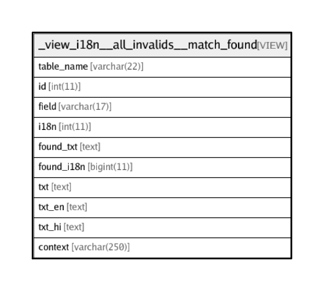

# _view_i18n__all_invalids__match_found

## Description

VIEW

<details>
<summary><strong>Table Definition</strong></summary>

```sql
CREATE VIEW _view_i18n__all_invalids__match_found AS (select `i`.`table_name` AS `table_name`,`i`.`id` AS `id`,`i`.`field` AS `field`,`i`.`i18n` AS `i18n`,(select `s`.`en` from `transaction_framework`.`i18n_lang_strings` `s` where (`i`.`txt` = `s`.`en`)) AS `found_txt`,(select `s`.`id` from `transaction_framework`.`i18n_lang_strings` `s` where (`i`.`txt` = `s`.`en`)) AS `found_i18n`,`i`.`txt` AS `txt`,`i`.`txt_en` AS `txt_en`,`i`.`txt_hi` AS `txt_hi`,`i`.`context` AS `context` from `transaction_framework`.`_view_i18n__all_invalids` `i` having (`found_txt` is not null) order by `i`.`table_name`,`i`.`txt`)
```

</details>

## Columns

| Name | Type | Default | Nullable | Children | Parents | Comment |
| ---- | ---- | ------- | -------- | -------- | ------- | ------- |
| table_name | varchar(22) |  | false |  |  |  |
| id | int(11) | 0 | false |  |  |  |
| field | varchar(17) |  | false |  |  |  |
| i18n | int(11) |  | true |  |  |  |
| found_txt | text |  | true |  |  |  |
| found_i18n | bigint(11) |  | true |  |  |  |
| txt | text |  | false |  |  |  |
| txt_en | text |  | true |  |  |  |
| txt_hi | text |  | true |  |  |  |
| context | varchar(250) |  | true |  |  |  |

## Relations



---

> Generated by [tbls](https://github.com/k1LoW/tbls)
