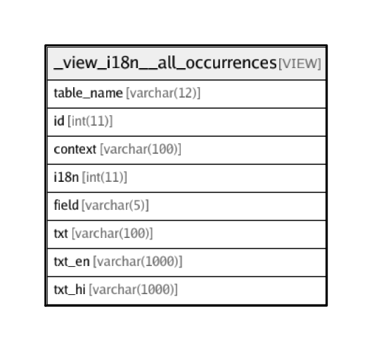

# _view_i18n__all_occurrences

## Description

VIEW

<details>
<summary><strong>Table Definition</strong></summary>

```sql
CREATE VIEW _view_i18n__all_occurrences AS (select 'interactions' AS `table_name`,`t`.`id` AS `id`,(`t`.`label` collate utf8_general_ci) AS `context`,`l`.`id` AS `i18n`,'label' AS `field`,(`t`.`label` collate utf8_general_ci) AS `txt`,`l`.`en` AS `txt_en`,`l`.`hi` AS `txt_hi` from (`transaction_framework`.`interactions` `t` left join `transaction_framework`.`i18n_lang_strings` `l` on((`t`.`label_i18n` = `l`.`id`))) where (`l`.`id` is not null) union select 'interactions' AS `table_name`,`t`.`id` AS `id`,(`t`.`label` collate utf8_general_ci) AS `context`,`l`.`id` AS `i18n`,'label_response' AS `field`,(`t`.`label_response` collate utf8_general_ci) AS `txt`,`l`.`en` AS `txt_en`,`l`.`hi` AS `txt_hi` from (`transaction_framework`.`interactions` `t` left join `transaction_framework`.`i18n_lang_strings` `l` on((`t`.`label_response_i18n` = `l`.`id`))) where (`l`.`id` is not null) union select 'interactions' AS `table_name`,`t`.`id` AS `id`,(`t`.`label` collate utf8_general_ci) AS `context`,`l`.`id` AS `i18n`,'history_label' AS `field`,(`t`.`history_label` collate utf8_general_ci) AS `txt`,`l`.`en` AS `txt_en`,`l`.`hi` AS `txt_hi` from (`transaction_framework`.`interactions` `t` left join `transaction_framework`.`i18n_lang_strings` `l` on((`t`.`history_label_i18n` = `l`.`id`))) where (`l`.`id` is not null) union select 'interactions' AS `table_name`,`t`.`id` AS `id`,(`t`.`label` collate utf8_general_ci) AS `context`,`l`.`id` AS `i18n`,'description' AS `field`,(`t`.`description` collate utf8_general_ci) AS `txt`,`l`.`en` AS `txt_en`,`l`.`hi` AS `txt_hi` from (`transaction_framework`.`interactions` `t` left join `transaction_framework`.`i18n_lang_strings` `l` on((`t`.`description_i18n` = `l`.`id`))) where (`l`.`id` is not null) union select 'parameters' AS `table_name`,`t`.`id` AS `id`,(concat_ws(', ',convert(`t`.`name` using utf8),`t`.`label`) collate utf8_general_ci) AS `context`,`l`.`id` AS `i18n`,'value' AS `field`,(`t`.`value` collate utf8_general_ci) AS `txt`,`l`.`en` AS `txt_en`,`l`.`hi` AS `txt_hi` from (`transaction_framework`.`parameters` `t` left join `transaction_framework`.`i18n_lang_strings` `l` on((`t`.`value_i18n` = `l`.`id`))) where (`l`.`id` is not null) union select 'parameters' AS `table_name`,`t`.`id` AS `id`,(concat_ws(', ',convert(`t`.`name` using utf8),`t`.`label`) collate utf8_general_ci) AS `context`,`l`.`id` AS `i18n`,'label' AS `field`,(`t`.`label` collate utf8_general_ci) AS `txt`,`l`.`en` AS `txt_en`,`l`.`hi` AS `txt_hi` from (`transaction_framework`.`parameters` `t` left join `transaction_framework`.`i18n_lang_strings` `l` on((`t`.`label_i18n` = `l`.`id`))) where (`l`.`id` is not null) union select 'parameters' AS `table_name`,`t`.`id` AS `id`,(concat_ws(', ',convert(`t`.`name` using utf8),`t`.`label`) collate utf8_general_ci) AS `context`,`l`.`id` AS `i18n`,'label_response' AS `field`,(`t`.`label_response` collate utf8_general_ci) AS `txt`,`l`.`en` AS `txt_en`,`l`.`hi` AS `txt_hi` from (`transaction_framework`.`parameters` `t` left join `transaction_framework`.`i18n_lang_strings` `l` on((`t`.`label_response_i18n` = `l`.`id`))) where (`l`.`id` is not null) union select 'parameters' AS `table_name`,`t`.`id` AS `id`,(concat_ws(', ',convert(`t`.`name` using utf8),`t`.`label`) collate utf8_general_ci) AS `context`,`l`.`id` AS `i18n`,'description' AS `field`,(`t`.`description` collate utf8_general_ci) AS `txt`,`l`.`en` AS `txt_en`,`l`.`hi` AS `txt_hi` from (`transaction_framework`.`parameters` `t` left join `transaction_framework`.`i18n_lang_strings` `l` on((`t`.`description_i18n` = `l`.`id`))) where (`l`.`id` is not null) union select 'interaction_categories' AS `table_name`,`t`.`id` AS `id`,('' collate utf8_general_ci) AS `context`,`l`.`id` AS `i18n`,'title' AS `field`,(`t`.`title` collate utf8_general_ci) AS `txt`,`l`.`en` AS `txt_en`,`l`.`hi` AS `txt_hi` from (`transaction_framework`.`interaction_categories` `t` left join `transaction_framework`.`i18n_lang_strings` `l` on((`t`.`title_i18n` = `l`.`id`))) where (`l`.`id` is not null) union select 'interaction_chains' AS `table_name`,`t`.`id` AS `id`,cast(`t`.`_context` as char charset utf8) AS `context`,`l`.`id` AS `i18n`,'label' AS `field`,(`t`.`label` collate utf8_general_ci) AS `txt`,`l`.`en` AS `txt_en`,`l`.`hi` AS `txt_hi` from (`transaction_framework`.`interaction_chains` `t` left join `transaction_framework`.`i18n_lang_strings` `l` on((`t`.`label_i18n` = `l`.`id`))) where (`l`.`id` is not null) union select 'interaction_chains' AS `table_name`,`t`.`id` AS `id`,cast(`t`.`_context` as char charset utf8) AS `context`,`l`.`id` AS `i18n`,'toast' AS `field`,(`t`.`toast` collate utf8_general_ci) AS `txt`,`l`.`en` AS `txt_en`,`l`.`hi` AS `txt_hi` from (`transaction_framework`.`interaction_chains` `t` left join `transaction_framework`.`i18n_lang_strings` `l` on((`t`.`toast_i18n` = `l`.`id`))) where (`l`.`id` is not null) union select 'list_elements' AS `table_name`,`t`.`id` AS `id`,('' collate utf8_general_ci) AS `context`,`l`.`id` AS `i18n`,'description' AS `field`,(`t`.`description` collate utf8_general_ci) AS `txt`,`l`.`en` AS `txt_en`,`l`.`hi` AS `txt_hi` from (`transaction_framework`.`list_elements` `t` left join `transaction_framework`.`i18n_lang_strings` `l` on((`t`.`description_i18n` = `l`.`id`))) where (`l`.`id` is not null) union select 'list_elements' AS `table_name`,`t`.`id` AS `id`,('' collate utf8_general_ci) AS `context`,`l`.`id` AS `i18n`,'label' AS `field`,(`t`.`label` collate utf8_general_ci) AS `txt`,`l`.`en` AS `txt_en`,`l`.`hi` AS `txt_hi` from (`transaction_framework`.`list_elements` `t` left join `transaction_framework`.`i18n_lang_strings` `l` on((`t`.`label_i18n` = `l`.`id`))) where (`l`.`id` is not null) union select 'responses' AS `table_name`,`t`.`id` AS `id`,cast(`t`.`_context` as char charset utf8) AS `context`,`l`.`id` AS `i18n`,'pre_msg_template' AS `field`,(`t`.`pre_msg_template` collate utf8_general_ci) AS `txt`,`l`.`en` AS `txt_en`,`l`.`hi` AS `txt_hi` from (`transaction_framework`.`responses` `t` left join `transaction_framework`.`i18n_lang_strings` `l` on((`t`.`pre_msg_template_i18n` = `l`.`id`))) where (`l`.`id` is not null) union select 'responses' AS `table_name`,`t`.`id` AS `id`,cast(`t`.`_context` as char charset utf8) AS `context`,`l`.`id` AS `i18n`,'post_msg_template' AS `field`,(`t`.`post_msg_template` collate utf8_general_ci) AS `txt`,`l`.`en` AS `txt_en`,`l`.`hi` AS `txt_hi` from (`transaction_framework`.`responses` `t` left join `transaction_framework`.`i18n_lang_strings` `l` on((`t`.`post_msg_template_i18n` = `l`.`id`))) where (`l`.`id` is not null))
```

</details>

## Columns

| Name | Type | Default | Nullable | Children | Parents | Comment |
| ---- | ---- | ------- | -------- | -------- | ------- | ------- |
| table_name | varchar(12) |  | false |  |  |  |
| id | int(11) | 0 | false |  |  |  |
| context | varchar(100) |  | false |  |  |  |
| i18n | int(11) |  | true |  |  |  |
| field | varchar(5) |  | false |  |  |  |
| txt | varchar(100) |  | false |  |  |  |
| txt_en | varchar(1000) |  | true |  |  | English |
| txt_hi | varchar(1000) |  | true |  |  | Hindi |

## Relations



---

> Generated by [tbls](https://github.com/k1LoW/tbls)
