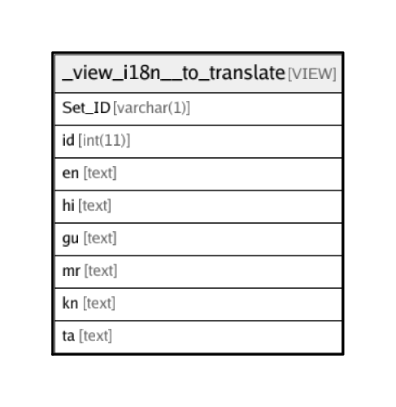

# _view_i18n__to_translate

## Description

VIEW

<details>
<summary><strong>Table Definition</strong></summary>

```sql
CREATE VIEW _view_i18n__to_translate AS (select '1' AS `Set_ID`,`transaction_framework`.`i18n_lang_strings`.`id` AS `id`,(`transaction_framework`.`i18n_lang_strings`.`en` collate UTF8_UNICODE_CI) AS `en`,(`transaction_framework`.`i18n_lang_strings`.`hi` collate UTF8_UNICODE_CI) AS `hi`,(`transaction_framework`.`i18n_lang_strings`.`gu` collate UTF8_UNICODE_CI) AS `gu`,(`transaction_framework`.`i18n_lang_strings`.`mr` collate UTF8_UNICODE_CI) AS `mr`,(`transaction_framework`.`i18n_lang_strings`.`kn` collate UTF8_UNICODE_CI) AS `kn`,(`transaction_framework`.`i18n_lang_strings`.`ta` collate UTF8_UNICODE_CI) AS `ta` from `transaction_framework`.`i18n_lang_strings` where (((`transaction_framework`.`i18n_lang_strings`.`hi` = '') or (`transaction_framework`.`i18n_lang_strings`.`gu` = '') or (`transaction_framework`.`i18n_lang_strings`.`mr` = '') or (`transaction_framework`.`i18n_lang_strings`.`kn` = '') or (`transaction_framework`.`i18n_lang_strings`.`ta` = '')) and (not(`transaction_framework`.`i18n_lang_strings`.`id` in (select `_view_i18n__unused_strings`.`id` from `transaction_framework`.`_view_i18n__unused_strings`)))) union select '2' AS `Set_ID`,`transaction_framework`.`i18n_lang_strings_app`.`id` AS `id`,(`transaction_framework`.`i18n_lang_strings_app`.`en` collate UTF8_UNICODE_CI) AS `en`,(`transaction_framework`.`i18n_lang_strings_app`.`hi` collate UTF8_UNICODE_CI) AS `hi`,(`transaction_framework`.`i18n_lang_strings_app`.`gu` collate UTF8_UNICODE_CI) AS `gu`,(`transaction_framework`.`i18n_lang_strings_app`.`mr` collate UTF8_UNICODE_CI) AS `mr`,(`transaction_framework`.`i18n_lang_strings_app`.`kn` collate UTF8_UNICODE_CI) AS `kn`,(`transaction_framework`.`i18n_lang_strings_app`.`ta` collate UTF8_UNICODE_CI) AS `ta` from `transaction_framework`.`i18n_lang_strings_app` where (((`transaction_framework`.`i18n_lang_strings_app`.`hi` = '') or (`transaction_framework`.`i18n_lang_strings_app`.`gu` = '') or (`transaction_framework`.`i18n_lang_strings_app`.`mr` = '') or (`transaction_framework`.`i18n_lang_strings_app`.`kn` = '') or (`transaction_framework`.`i18n_lang_strings_app`.`ta` = '')) and (`transaction_framework`.`i18n_lang_strings_app`.`disabled` = 0)))
```

</details>

## Columns

| Name | Type | Default | Nullable | Children | Parents | Comment |
| ---- | ---- | ------- | -------- | -------- | ------- | ------- |
| Set_ID | varchar(1) |  | false |  |  |  |
| id | int(11) |  | false |  |  |  |
| en | text |  | false |  |  |  |
| hi | text |  | false |  |  |  |
| gu | text |  | false |  |  |  |
| mr | text |  | false |  |  |  |
| kn | text |  | false |  |  |  |
| ta | text |  | false |  |  |  |

## Relations



---

> Generated by [tbls](https://github.com/k1LoW/tbls)
