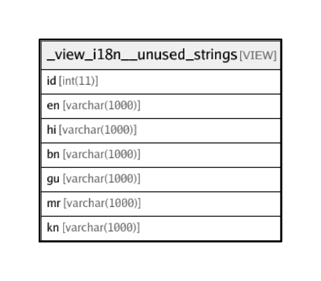

# _view_i18n__unused_strings

## Description

VIEW

<details>
<summary><strong>Table Definition</strong></summary>

```sql
CREATE VIEW _view_i18n__unused_strings AS (select `s1`.`id` AS `id`,`s1`.`en` AS `en`,`s1`.`hi` AS `hi`,`s1`.`bn` AS `bn`,`s1`.`gu` AS `gu`,`s1`.`mr` AS `mr`,`s1`.`kn` AS `kn` from `transaction_framework`.`i18n_lang_strings` `s1` where (not(exists(select `s2`.`id` from `transaction_framework`.`_view_i18n__all_occurrences` `s2` where (`s2`.`i18n` = `s1`.`id`)))))
```

</details>

## Columns

| Name | Type | Default | Nullable | Children | Parents | Comment |
| ---- | ---- | ------- | -------- | -------- | ------- | ------- |
| id | int(11) |  | false |  |  |  |
| en | varchar(1000) |  | false |  |  | English |
| hi | varchar(1000) |  | false |  |  | Hindi |
| bn | varchar(1000) |  | false |  |  | Bengali |
| gu | varchar(1000) |  | false |  |  | Gujarati |
| mr | varchar(1000) |  | false |  |  | Marathi |
| kn | varchar(1000) |  | false |  |  | Kannada |

## Relations



---

> Generated by [tbls](https://github.com/k1LoW/tbls)
