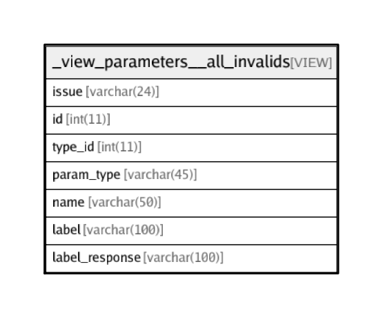

# _view_parameters__all_invalids

## Description

VIEW

<details>
<summary><strong>Table Definition</strong></summary>

```sql
CREATE VIEW _view_parameters__all_invalids AS (select 'Label in Invisible Param' AS `issue`,`p`.`id` AS `id`,`p`.`parameter_type_id` AS `type_id`,`t`.`name` AS `param_type`,`p`.`name` AS `name`,`p`.`label` AS `label`,`p`.`label_response` AS `label_response` from (`transaction_framework`.`parameters` `p` left join `transaction_framework`.`parameter_types` `t` on((`t`.`id` = `p`.`parameter_type_id`))) where ((`p`.`parameter_type_id` in (1,6,7,23,27)) and ((`p`.`label` <> '') or (`p`.`label_response` <> ''))) union all select 'Label same as Label_Response' AS `issue`,`p`.`id` AS `id`,`p`.`parameter_type_id` AS `type_id`,`t`.`name` AS `param_type`,`p`.`name` AS `name`,`p`.`label` AS `label`,`p`.`label_response` AS `label_response` from (`transaction_framework`.`parameters` `p` left join `transaction_framework`.`parameter_types` `t` on((`t`.`id` = `p`.`parameter_type_id`))) where ((`p`.`label` <> '') and (`p`.`label` = `p`.`label_response`)))
```

</details>

## Columns

| Name | Type | Default | Nullable | Children | Parents | Comment |
| ---- | ---- | ------- | -------- | -------- | ------- | ------- |
| issue | varchar(24) |  | false |  |  |  |
| id | int(11) | 0 | false |  |  |  |
| type_id | int(11) |  | false |  |  |  |
| param_type | varchar(45) |  | true |  |  |  |
| name | varchar(50) |  | true |  |  | Parameter name to be sent as name/value pair to the server. If blank, the parameter is not sent to the server. |
| label | varchar(100) |  | false |  |  |  |
| label_response | varchar(100) |  | false |  |  |  |

## Relations



---

> Generated by [tbls](https://github.com/k1LoW/tbls)
