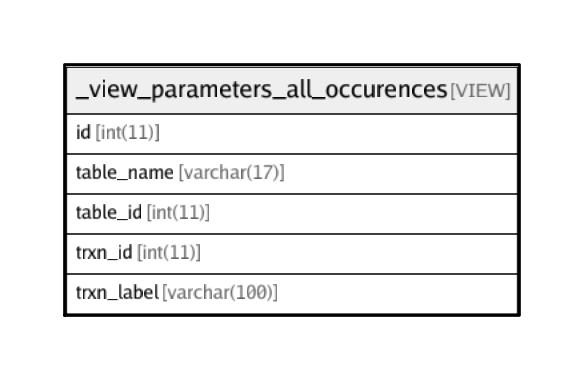

# _view_parameters_all_occurences

## Description

VIEW

<details>
<summary><strong>Table Definition</strong></summary>

```sql
CREATE VIEW _view_parameters_all_occurences AS (select `r`.`parameter_id` AS `id`,'request_structure' AS `table_name`,`r`.`id` AS `table_id`,`i`.`id` AS `trxn_id`,`i`.`label` AS `trxn_label` from (`transaction_framework`.`request_structure` `r` left join `transaction_framework`.`interactions` `i` on((`i`.`id` = `r`.`interaction_id`))) union select `r`.`parameter_id` AS `id`,'response_structure' AS `table_name`,`r`.`id` AS `table_id`,`i`.`id` AS `trxn_id`,`i`.`label` AS `trxn_label` from ((`transaction_framework`.`response_structure` `r` left join `transaction_framework`.`response_interaction_map` `m` on((`r`.`response_id` = `m`.`response_id`))) left join `transaction_framework`.`interactions` `i` on((`i`.`id` = `m`.`interaction_id`))) union select `g`.`member_parameter_id` AS `id`,'response_parameter_groups' AS `table_name`,`g`.`id` AS `table_id`,`i`.`id` AS `trxn_id`,`i`.`label` AS `trxn_label` from ((((`transaction_framework`.`response_parameter_groups` `g` left join `transaction_framework`.`parameters` `gp` on((`gp`.`id` = `g`.`group_parameter_id`))) left join `transaction_framework`.`response_structure` `r` on((`r`.`parameter_id` = `gp`.`id`))) left join `transaction_framework`.`response_interaction_map` `m` on((`r`.`id` = `m`.`response_id`))) left join `transaction_framework`.`interactions` `i` on((`i`.`id` = `m`.`interaction_id`))) union select `cp`.`parameter_id` AS `id`,'interaction_chain_input_parameters' AS `table_name`,`cp`.`id` AS `table_id`,`i`.`id` AS `trxn_id`,`i`.`label` AS `trxn_label` from (((`transaction_framework`.`interaction_chain_input_parameters` `cp` left join `transaction_framework`.`interaction_chains` `ic` on((`ic`.`id` = `cp`.`interaction_chain_id`))) left join `transaction_framework`.`response_interaction_map` `m` on((`ic`.`response_interaction_map_id` = `m`.`id`))) left join `transaction_framework`.`interactions` `i` on((`i`.`id` = `m`.`interaction_id`))))
```

</details>

## Columns

| Name | Type | Default | Nullable | Children | Parents | Comment |
| ---- | ---- | ------- | -------- | -------- | ------- | ------- |
| id | int(11) |  | false |  |  |  |
| table_name | varchar(17) |  | false |  |  |  |
| table_id | int(11) | 0 | false |  |  |  |
| trxn_id | int(11) | 0 | true |  |  |  |
| trxn_label | varchar(100) |  | true |  |  |  |

## Relations



---

> Generated by [tbls](https://github.com/k1LoW/tbls)
