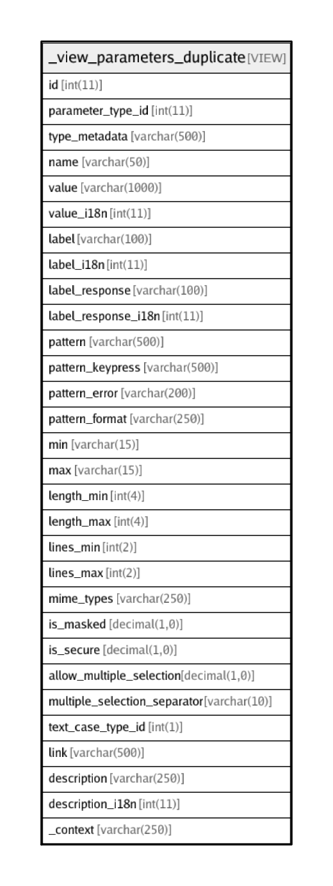

# _view_parameters_duplicate

## Description

VIEW

<details>
<summary><strong>Table Definition</strong></summary>

```sql
CREATE VIEW _view_parameters_duplicate AS (select `p`.`id` AS `id`,`p`.`parameter_type_id` AS `parameter_type_id`,`p`.`type_metadata` AS `type_metadata`,`p`.`name` AS `name`,`p`.`value` AS `value`,`p`.`value_i18n` AS `value_i18n`,`p`.`label` AS `label`,`p`.`label_i18n` AS `label_i18n`,`p`.`label_response` AS `label_response`,`p`.`label_response_i18n` AS `label_response_i18n`,`p`.`pattern` AS `pattern`,`p`.`pattern_keypress` AS `pattern_keypress`,`p`.`pattern_error` AS `pattern_error`,`p`.`pattern_format` AS `pattern_format`,`p`.`min` AS `min`,`p`.`max` AS `max`,`p`.`length_min` AS `length_min`,`p`.`length_max` AS `length_max`,`p`.`lines_min` AS `lines_min`,`p`.`lines_max` AS `lines_max`,`p`.`mime_types` AS `mime_types`,`p`.`is_masked` AS `is_masked`,`p`.`is_secure` AS `is_secure`,`p`.`allow_multiple_selection` AS `allow_multiple_selection`,`p`.`multiple_selection_separator` AS `multiple_selection_separator`,`p`.`text_case_type_id` AS `text_case_type_id`,`p`.`link` AS `link`,`p`.`description` AS `description`,`p`.`description_i18n` AS `description_i18n`,`p`.`_context` AS `_context` from `transaction_framework`.`parameters` `p` where exists(select 1 from `transaction_framework`.`parameters` `p2` where ((`p`.`id` <> `p2`.`id`) and (`p`.`name` = `p2`.`name`) and (`p`.`parameter_type_id` <> 3) and (`p`.`parameter_type_id` = `p2`.`parameter_type_id`) and (((`p`.`label` = '') and (`p2`.`label` = '') and (`p`.`label_response` = '') and (`p2`.`label_response` = '')) or ((`p`.`label` <> '') and (`p`.`label` = `p2`.`label`)) or ((`p`.`label_response` <> '') and (`p`.`label_response` = `p2`.`label_response`)) or ((`p`.`label` <> '') and (`p`.`label` = `p2`.`label_response`)) or ((`p2`.`label` <> '') and (`p`.`label_response` = `p2`.`label`))) and (`p`.`value` = `p2`.`value`) and ((isnull(`p`.`type_metadata`) and isnull(`p2`.`type_metadata`)) or (`p`.`type_metadata` = `p2`.`type_metadata`)) and ((`p`.`min` = `p2`.`min`) or (`p`.`min` = 0)) and ((`p`.`max` = `p2`.`max`) or (`p`.`min` = 0)) and ((`p`.`length_min` = `p2`.`length_min`) or (`p`.`length_min` = 0)) and ((`p`.`length_max` = `p2`.`length_max`) or (`p`.`length_max` = 0)))) order by `p`.`name`)
```

</details>

## Columns

| Name | Type | Default | Nullable | Children | Parents | Comment |
| ---- | ---- | ------- | -------- | -------- | ------- | ------- |
| id | int(11) | 0 | false |  |  |  |
| parameter_type_id | int(11) |  | false |  |  |  |
| type_metadata | varchar(500) |  | true |  |  | Extra info about some parameter types.<br>DateTime format (eg: ddMMyyyy), Currency code (eg: INR) etc.<br>DateTime format specified as Java SimpleDateFormat specifiers (http://developer.android.com/reference/java/text/SimpleDateFormat.html). |
| name | varchar(50) |  | true |  |  | Parameter name to be sent as name/value pair to the server. If blank, the parameter is not sent to the server. |
| value | varchar(1000) |  | false |  |  |  |
| value_i18n | int(11) |  | true |  |  |  |
| label | varchar(100) |  | false |  |  |  |
| label_i18n | int(11) |  | true |  |  |  |
| label_response | varchar(100) |  | false |  |  |  |
| label_response_i18n | int(11) |  | true |  |  |  |
| pattern | varchar(500) |  | false |  |  |  |
| pattern_keypress | varchar(500) |  | false |  |  |  |
| pattern_error | varchar(200) |  | true |  |  | Error message in case the user entry does not match the valid regex pattern |
| pattern_format | varchar(250) |  | true |  |  |  |
| min | varchar(15) | 0 | false |  |  | Minimum value for validation of Numeric/Money/DateTime types.<br>For DateTime: specify range in D=Days (default), W=Weeks, M=Months, Y=Years, etc.<br>Eg: Min=-3 and Max=0 means from 3 days ago to Today (0) |
| max | varchar(15) | 0 | false |  |  | Maximum value for validation of Numeric/Money/DateTime types.<br>For DateTime: specify range in D=Days (default), W=Weeks, M=Months, Y=Years, etc.<br>Eg: Min=-3 and Max=0 means from 3 days ago to Today (0) |
| length_min | int(4) | 0 | false |  |  |  |
| length_max | int(4) | 250 | false |  |  |  |
| lines_min | int(2) | 0 | false |  |  | For multi-line text input field |
| lines_max | int(2) | 0 | false |  |  | For multi-line text input field |
| mime_types | varchar(250) |  | false |  |  | Accepted mime-types for RAW data (file upload) |
| is_masked | decimal(1,0) | 0 | false |  |  | Mask field with * (eg: for Password field)  |
| is_secure | decimal(1,0) | 0 | false |  |  | Handle data securely. Do not cache. |
| allow_multiple_selection | decimal(1,0) | 0 | false |  |  | Allow multi-select in a LIST type parameter |
| multiple_selection_separator | varchar(10) |  | false |  |  | To separate multiple items when (for multi-select list) |
| text_case_type_id | int(1) | 0 | false |  |  | 0:default, 1:upper, 2:lower, 3:camel, 4:sentence |
| link | varchar(500) |  | false |  |  | Any external URL to show with the parameter. Eg: Show link for Aadhaar/Voter-card Verification sites.<br>Value in <label>|<url> format. Eg: Verify|https://eaadhaar.uidai.gov.in |
| description | varchar(250) |  | false |  |  |  |
| description_i18n | int(11) |  | true |  |  |  |
| _context | varchar(250) |  | true |  |  | Any comment for internal development usage |

## Relations



---

> Generated by [tbls](https://github.com/k1LoW/tbls)
