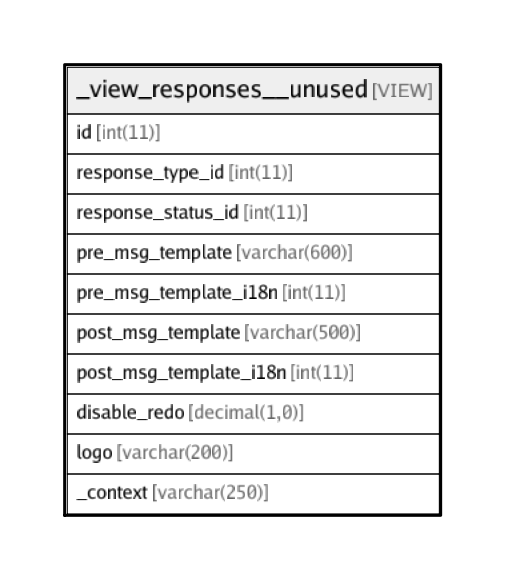

# _view_responses__unused

## Description

VIEW

<details>
<summary><strong>Table Definition</strong></summary>

```sql
CREATE VIEW _view_responses__unused AS (select `r`.`id` AS `id`,`r`.`response_type_id` AS `response_type_id`,`r`.`response_status_id` AS `response_status_id`,`r`.`pre_msg_template` AS `pre_msg_template`,`r`.`pre_msg_template_i18n` AS `pre_msg_template_i18n`,`r`.`post_msg_template` AS `post_msg_template`,`r`.`post_msg_template_i18n` AS `post_msg_template_i18n`,`r`.`disable_redo` AS `disable_redo`,`r`.`logo` AS `logo`,`r`.`_context` AS `_context` from `transaction_framework`.`responses` `r` where (not(`r`.`id` in (select `transaction_framework`.`response_interaction_map`.`response_id` from `transaction_framework`.`response_interaction_map`))))
```

</details>

## Columns

| Name | Type | Default | Nullable | Children | Parents | Comment |
| ---- | ---- | ------- | -------- | -------- | ------- | ------- |
| id | int(11) |  | false |  |  |  |
| response_type_id | int(11) |  | true |  |  |  |
| response_status_id | int(11) | 0 | true |  |  |  |
| pre_msg_template | varchar(600) |  | false |  |  |  |
| pre_msg_template_i18n | int(11) |  | true |  |  |  |
| post_msg_template | varchar(500) |  | false |  |  |  |
| post_msg_template_i18n | int(11) |  | true |  |  |  |
| disable_redo | decimal(1,0) | 0 | false |  |  | Do not allow user to jump back to this response card by clicking on it (when it is in preview mode) |
| logo | varchar(200) |  | false |  |  | LOGO / Branding image absolute URI to show on top-right side of response cards. MAX-HEIGHT: 50px |
| _context | varchar(250) |  | true |  |  | more info about this response for internal usage |

## Relations



---

> Generated by [tbls](https://github.com/k1LoW/tbls)
