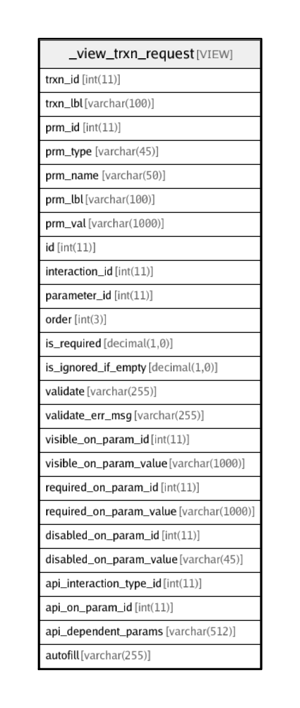

# _view_trxn_request

## Description

VIEW

<details>
<summary><strong>Table Definition</strong></summary>

```sql
CREATE VIEW _view_trxn_request AS (select `i`.`id` AS `trxn_id`,`i`.`label` AS `trxn_lbl`,`p`.`id` AS `prm_id`,`t`.`name` AS `prm_type`,`p`.`name` AS `prm_name`,`p`.`label` AS `prm_lbl`,`p`.`value` AS `prm_val`,`r`.`id` AS `id`,`r`.`interaction_id` AS `interaction_id`,`r`.`parameter_id` AS `parameter_id`,`r`.`order` AS `order`,`r`.`is_required` AS `is_required`,`r`.`is_ignored_if_empty` AS `is_ignored_if_empty`,`r`.`validate` AS `validate`,`r`.`validate_err_msg` AS `validate_err_msg`,`r`.`visible_on_param_id` AS `visible_on_param_id`,`r`.`visible_on_param_value` AS `visible_on_param_value`,`r`.`required_on_param_id` AS `required_on_param_id`,`r`.`required_on_param_value` AS `required_on_param_value`,`r`.`disabled_on_param_id` AS `disabled_on_param_id`,`r`.`disabled_on_param_value` AS `disabled_on_param_value`,`r`.`api_interaction_type_id` AS `api_interaction_type_id`,`r`.`api_on_param_id` AS `api_on_param_id`,`r`.`api_dependent_params` AS `api_dependent_params`,`r`.`autofill` AS `autofill` from (((`transaction_framework`.`request_structure` `r` left join `transaction_framework`.`parameters` `p` on((`r`.`parameter_id` = `p`.`id`))) left join `transaction_framework`.`parameter_types` `t` on((`p`.`parameter_type_id` = `t`.`id`))) left join `transaction_framework`.`interactions` `i` on((`r`.`interaction_id` = `i`.`id`))) order by `i`.`id`,`r`.`order`)
```

</details>

## Columns

| Name | Type | Default | Nullable | Children | Parents | Comment |
| ---- | ---- | ------- | -------- | -------- | ------- | ------- |
| trxn_id | int(11) | 0 | true |  |  |  |
| trxn_lbl | varchar(100) |  | true |  |  |  |
| prm_id | int(11) | 0 | true |  |  |  |
| prm_type | varchar(45) |  | true |  |  |  |
| prm_name | varchar(50) |  | true |  |  | Parameter name to be sent as name/value pair to the server. If blank, the parameter is not sent to the server. |
| prm_lbl | varchar(100) |  | true |  |  |  |
| prm_val | varchar(1000) |  | true |  |  |  |
| id | int(11) | 0 | false |  |  |  |
| interaction_id | int(11) |  | false |  |  |  |
| parameter_id | int(11) |  | false |  |  |  |
| order | int(3) |  | true |  |  | Order number in which the request parameters should be displayed |
| is_required | decimal(1,0) | 1 | false |  |  | Is it mandatory to provide a value for this field? |
| is_ignored_if_empty | decimal(1,0) | 0 | false |  |  | Do not send the parameter in HTTP request if the value is empty |
| validate | varchar(255) |  | false |  |  | Custom validation expression. Use {} for current field's value. Use {param-name} to use another parameter's value.<br>Supports LISP like notation in JSON ARRAY format. First item in array is function name and next items are the operands.<br>Eg: (this-field>amount && this-field<=max_amount) will be written as: ['&&',  ['>',{},{amount}], ['<=',{},{max_amount}]] |
| validate_err_msg | varchar(255) |  | false |  |  | Error message to show when the validation fails |
| visible_on_param_id | int(11) | 0 | false |  |  | id of PARAMETER on which the visibility of this PARAMETER depends |
| visible_on_param_value | varchar(1000) |  | false |  |  | value of PARAMETER on which the visibility of this PARAMETER depends |
| required_on_param_id | int(11) | 0 | false |  |  | id of PARAMETER on which the optionality of this PARAMETER depends |
| required_on_param_value | varchar(1000) |  | false |  |  | value of PARAMETER on which the optionality of this PARAMETER depends |
| disabled_on_param_id | int(11) | 0 | false |  |  | id of PARAMETER based on which this PARAMETER is enabled/disabled |
| disabled_on_param_value | varchar(45) |  | false |  |  | value of PARAMETER based on which this PARAMETER is enabled/disabled |
| api_interaction_type_id | int(11) | 0 | false |  |  | interaction_type_id for making a API call to modify this field in real time |
| api_on_param_id | int(11) | 0 | false |  |  | id of PARAMETER on which the API call depends. API is called every time that parameter changes |
| api_dependent_params | varchar(512) |  | false |  |  | Structure to define dependent parameters, map current parameter name with API parameter name and define constraints. Eg:<br>{<br>  "utility_acc_no": {                                            // Call this API if utility_acc_no changes<br>        "api_param_name":"mobile_number",        // Send value of utility_acc_no as mobile_number to the API (map utility_acc_no to mobile_number)<br>        "length_max":4,                                         // Do not call API if length of utility_acc_no > 4<br>        "length_min":4                                           // Do not call API if length of utility_acc_no < 4<br>  },<br><br>  "service_type":{}                                             // Also call API if service_type changes. No mapping or constraints<br>} |
| autofill | varchar(255) |  | false |  |  | Comma separated list of values to show as autofill. Eg: "1000,2000,5000" for amount field. |

## Relations



---

> Generated by [tbls](https://github.com/k1LoW/tbls)
