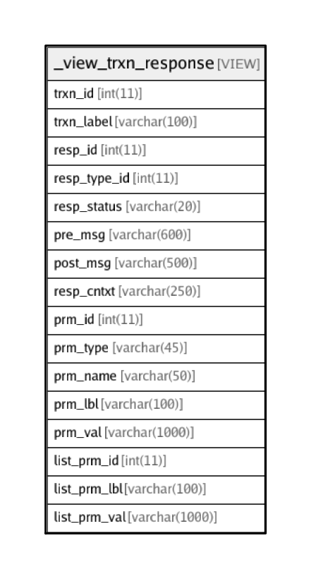

# _view_trxn_response

## Description

VIEW

<details>
<summary><strong>Table Definition</strong></summary>

```sql
CREATE VIEW _view_trxn_response AS (select `i`.`id` AS `trxn_id`,`i`.`label` AS `trxn_label`,`r`.`id` AS `resp_id`,`r`.`response_type_id` AS `resp_type_id`,`st`.`name` AS `resp_status`,`r`.`pre_msg_template` AS `pre_msg`,`r`.`post_msg_template` AS `post_msg`,`r`.`_context` AS `resp_cntxt`,`p`.`id` AS `prm_id`,`pt`.`name` AS `prm_type`,`p`.`name` AS `prm_name`,if((isnull(`p`.`label_response`) or (`p`.`label_response` = '')),`p`.`label`,`p`.`label_response`) AS `prm_lbl`,`p`.`value` AS `prm_val`,`gp`.`id` AS `list_prm_id`,if((isnull(`gp`.`label_response`) or (`gp`.`label_response` = '')),`gp`.`label`,`gp`.`label_response`) AS `list_prm_lbl`,`gp`.`value` AS `list_prm_val` from ((((((((`transaction_framework`.`response_interaction_map` `rm` left join `transaction_framework`.`interactions` `i` on((`rm`.`interaction_id` = `i`.`id`))) left join `transaction_framework`.`responses` `r` on((`r`.`id` = `rm`.`response_id`))) left join `transaction_framework`.`response_status` `st` on((`r`.`response_status_id` = `st`.`id`))) left join `transaction_framework`.`response_structure` `rs` on((`r`.`id` = `rs`.`response_id`))) left join `transaction_framework`.`parameters` `p` on((`rs`.`parameter_id` = `p`.`id`))) left join `transaction_framework`.`parameter_types` `pt` on((`p`.`parameter_type_id` = `pt`.`id`))) left join `transaction_framework`.`response_parameter_groups` `rpg` on(((`p`.`parameter_type_id` = 5) and (`p`.`id` = `rpg`.`group_parameter_id`)))) left join `transaction_framework`.`parameters` `gp` on((`rpg`.`member_parameter_id` = `gp`.`id`))) order by `i`.`id`,`r`.`id`,`rs`.`order`,`gp`.`id`)
```

</details>

## Columns

| Name | Type | Default | Nullable | Children | Parents | Comment |
| ---- | ---- | ------- | -------- | -------- | ------- | ------- |
| trxn_id | int(11) | 0 | true |  |  |  |
| trxn_label | varchar(100) |  | true |  |  |  |
| resp_id | int(11) |  | true |  |  |  |
| resp_type_id | int(11) |  | true |  |  |  |
| resp_status | varchar(20) |  | true |  |  |  |
| pre_msg | varchar(600) |  | true |  |  |  |
| post_msg | varchar(500) |  | true |  |  |  |
| resp_cntxt | varchar(250) |  | true |  |  | more info about this response for internal usage |
| prm_id | int(11) | 0 | true |  |  |  |
| prm_type | varchar(45) |  | true |  |  |  |
| prm_name | varchar(50) |  | true |  |  | Parameter name to be sent as name/value pair to the server. If blank, the parameter is not sent to the server. |
| prm_lbl | varchar(100) |  | true |  |  |  |
| prm_val | varchar(1000) |  | true |  |  |  |
| list_prm_id | int(11) | 0 | true |  |  |  |
| list_prm_lbl | varchar(100) |  | true |  |  |  |
| list_prm_val | varchar(1000) |  | true |  |  |  |

## Relations



---

> Generated by [tbls](https://github.com/k1LoW/tbls)
