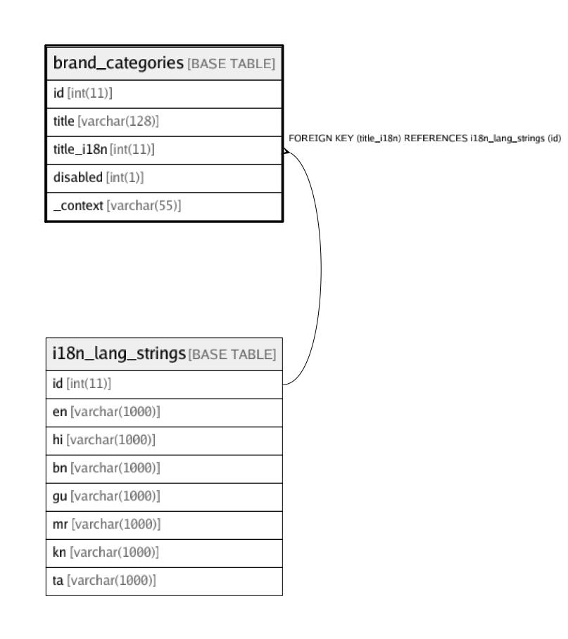

# brand_categories

## Description

<details>
<summary><strong>Table Definition</strong></summary>

```sql
CREATE TABLE `brand_categories` (
  `id` int(11) NOT NULL AUTO_INCREMENT,
  `title` varchar(128) NOT NULL,
  `title_i18n` int(11) DEFAULT NULL,
  `disabled` int(1) NOT NULL DEFAULT '0',
  `_context` varchar(55) DEFAULT NULL,
  PRIMARY KEY (`id`),
  KEY `fk_brand_categories_title_i18n_idx` (`title_i18n`),
  CONSTRAINT `fk_brand_categories_title_i18n` FOREIGN KEY (`title_i18n`) REFERENCES `i18n_lang_strings` (`id`) ON DELETE CASCADE ON UPDATE CASCADE
) ENGINE=InnoDB AUTO_INCREMENT=21 DEFAULT CHARSET=latin1
```

</details>

## Columns

| Name | Type | Default | Nullable | Children | Parents | Comment |
| ---- | ---- | ------- | -------- | -------- | ------- | ------- |
| id | int(11) |  | false |  |  |  |
| title | varchar(128) |  | false |  |  |  |
| title_i18n | int(11) |  | true |  | [i18n_lang_strings](i18n_lang_strings.md) |  |
| disabled | int(1) | 0 | false |  |  |  |
| _context | varchar(55) |  | true |  |  |  |

## Constraints

| Name | Type | Definition |
| ---- | ---- | ---------- |
| fk_brand_categories_title_i18n | FOREIGN KEY | FOREIGN KEY (title_i18n) REFERENCES i18n_lang_strings (id) |
| PRIMARY | PRIMARY KEY | PRIMARY KEY (id) |

## Indexes

| Name | Definition |
| ---- | ---------- |
| fk_brand_categories_title_i18n_idx | KEY fk_brand_categories_title_i18n_idx (title_i18n) USING BTREE |
| PRIMARY | PRIMARY KEY (id) USING BTREE |

## Relations



---

> Generated by [tbls](https://github.com/k1LoW/tbls)
