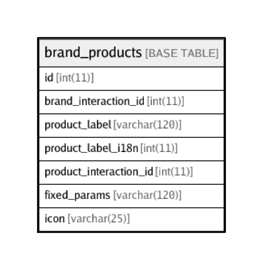

# brand_products

## Description

<details>
<summary><strong>Table Definition</strong></summary>

```sql
CREATE TABLE `brand_products` (
  `id` int(11) NOT NULL AUTO_INCREMENT,
  `brand_interaction_id` int(11) NOT NULL,
  `product_label` varchar(120) NOT NULL,
  `product_label_i18n` int(11) DEFAULT NULL,
  `product_interaction_id` int(11) NOT NULL,
  `fixed_params` varchar(120) DEFAULT NULL,
  `icon` varchar(25) DEFAULT NULL,
  PRIMARY KEY (`id`)
) ENGINE=InnoDB DEFAULT CHARSET=latin1
```

</details>

## Columns

| Name | Type | Default | Nullable | Children | Parents | Comment |
| ---- | ---- | ------- | -------- | -------- | ------- | ------- |
| id | int(11) |  | false |  |  |  |
| brand_interaction_id | int(11) |  | false |  |  |  |
| product_label | varchar(120) |  | false |  |  |  |
| product_label_i18n | int(11) |  | true |  |  |  |
| product_interaction_id | int(11) |  | false |  |  |  |
| fixed_params | varchar(120) |  | true |  |  |  |
| icon | varchar(25) |  | true |  |  |  |

## Constraints

| Name | Type | Definition |
| ---- | ---- | ---------- |
| PRIMARY | PRIMARY KEY | PRIMARY KEY (id) |

## Indexes

| Name | Definition |
| ---- | ---------- |
| PRIMARY | PRIMARY KEY (id) USING BTREE |

## Relations



---

> Generated by [tbls](https://github.com/k1LoW/tbls)
