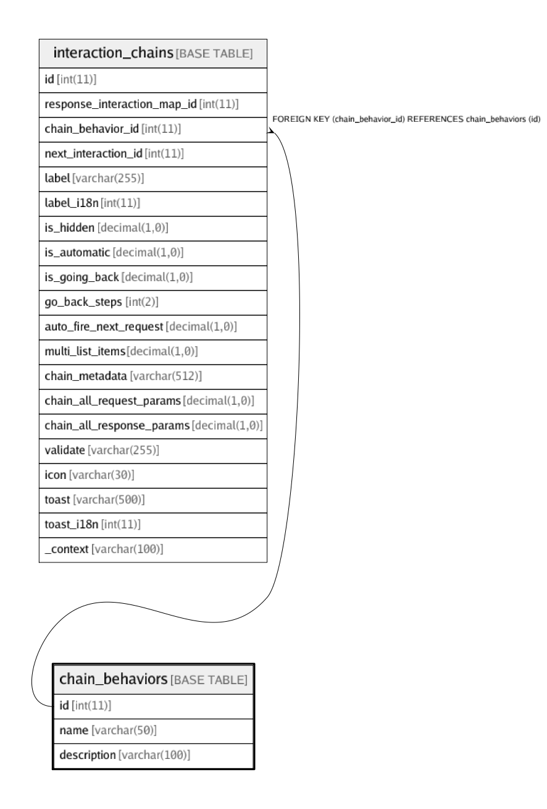

# chain_behaviors

## Description

<details>
<summary><strong>Table Definition</strong></summary>

```sql
CREATE TABLE `chain_behaviors` (
  `id` int(11) NOT NULL,
  `name` varchar(50) CHARACTER SET utf8 COLLATE utf8_unicode_ci NOT NULL COMMENT 'For describing the chain behavior like normal, external_url or payment gateway',
  `description` varchar(100) CHARACTER SET utf8 COLLATE utf8_unicode_ci DEFAULT NULL,
  PRIMARY KEY (`id`)
) ENGINE=InnoDB DEFAULT CHARSET=utf8 COLLATE=utf8_unicode_ci
```

</details>

## Columns

| Name | Type | Default | Nullable | Children | Parents | Comment |
| ---- | ---- | ------- | -------- | -------- | ------- | ------- |
| id | int(11) |  | false | [interaction_chains](interaction_chains.md) |  |  |
| name | varchar(50) |  | false |  |  | For describing the chain behavior like normal, external_url or payment gateway |
| description | varchar(100) |  | true |  |  |  |

## Constraints

| Name | Type | Definition |
| ---- | ---- | ---------- |
| PRIMARY | PRIMARY KEY | PRIMARY KEY (id) |

## Indexes

| Name | Definition |
| ---- | ---------- |
| PRIMARY | PRIMARY KEY (id) USING BTREE |

## Relations



---

> Generated by [tbls](https://github.com/k1LoW/tbls)
