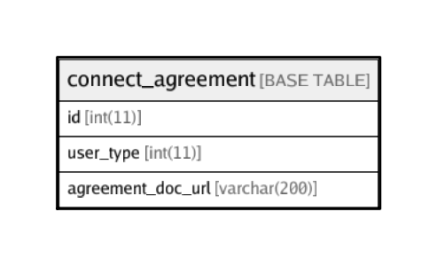

# connect_agreement

## Description

<details>
<summary><strong>Table Definition</strong></summary>

```sql
CREATE TABLE `connect_agreement` (
  `id` int(11) NOT NULL AUTO_INCREMENT,
  `user_type` int(11) NOT NULL,
  `agreement_doc_url` varchar(200) DEFAULT NULL COMMENT 'Full URL for help document (usually a public Google doc)',
  PRIMARY KEY (`id`),
  UNIQUE KEY `ind_role_id` (`user_type`)
) ENGINE=InnoDB AUTO_INCREMENT=7 DEFAULT CHARSET=latin1
```

</details>

## Columns

| Name | Type | Default | Nullable | Children | Parents | Comment |
| ---- | ---- | ------- | -------- | -------- | ------- | ------- |
| id | int(11) |  | false |  |  |  |
| user_type | int(11) |  | false |  |  |  |
| agreement_doc_url | varchar(200) |  | true |  |  | Full URL for help document (usually a public Google doc) |

## Constraints

| Name | Type | Definition |
| ---- | ---- | ---------- |
| ind_role_id | UNIQUE | UNIQUE KEY ind_role_id (user_type) |
| PRIMARY | PRIMARY KEY | PRIMARY KEY (id) |

## Indexes

| Name | Definition |
| ---- | ---------- |
| PRIMARY | PRIMARY KEY (id) USING BTREE |
| ind_role_id | UNIQUE KEY ind_role_id (user_type) USING BTREE |

## Relations



---

> Generated by [tbls](https://github.com/k1LoW/tbls)
