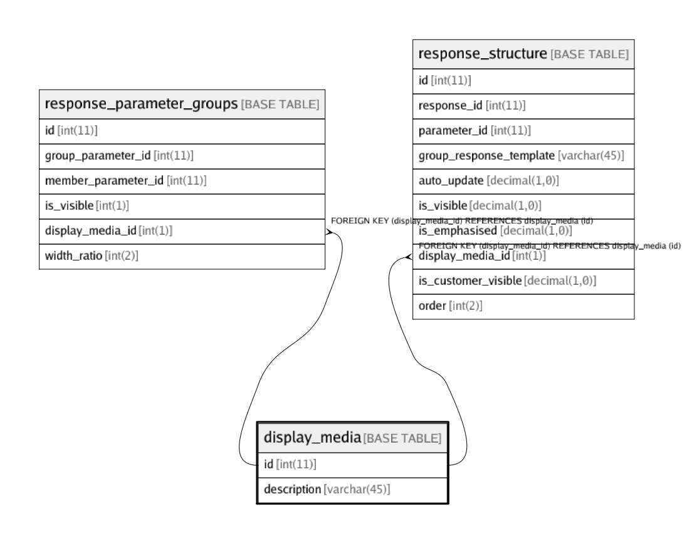

# display_media

## Description

Which media to show a response-parameter on? Eg: screen, paper, both, none, etc

<details>
<summary><strong>Table Definition</strong></summary>

```sql
CREATE TABLE `display_media` (
  `id` int(11) NOT NULL,
  `description` varchar(45) DEFAULT NULL,
  PRIMARY KEY (`id`)
) ENGINE=InnoDB DEFAULT CHARSET=utf8 COMMENT='Which media to show a response-parameter on? Eg: screen, paper, both, none, etc'
```

</details>

## Columns

| Name | Type | Default | Nullable | Children | Parents | Comment |
| ---- | ---- | ------- | -------- | -------- | ------- | ------- |
| id | int(11) |  | false | [response_parameter_groups](response_parameter_groups.md) [response_structure](response_structure.md) |  |  |
| description | varchar(45) |  | true |  |  |  |

## Constraints

| Name | Type | Definition |
| ---- | ---- | ---------- |
| PRIMARY | PRIMARY KEY | PRIMARY KEY (id) |

## Indexes

| Name | Definition |
| ---- | ---------- |
| PRIMARY | PRIMARY KEY (id) USING BTREE |

## Relations



---

> Generated by [tbls](https://github.com/k1LoW/tbls)
