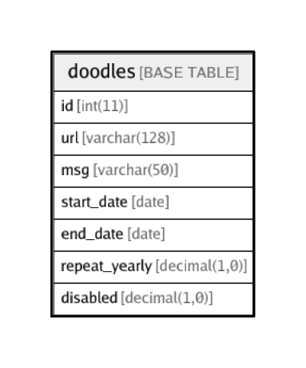

# doodles

## Description

<details>
<summary><strong>Table Definition</strong></summary>

```sql
CREATE TABLE `doodles` (
  `id` int(11) NOT NULL AUTO_INCREMENT,
  `url` varchar(128) CHARACTER SET utf8 COLLATE utf8_unicode_ci NOT NULL COMMENT 'Filename/URL of doodle. If it contains only filename, the doodle should be stored in the default location in Connect (images/doodle) otherwise a complete URL may be provided.\nDoodle must be 256px x 54px with proper padding. If background is transparent, image must be left-aligned.',
  `msg` varchar(50) CHARACTER SET utf8 COLLATE utf8_unicode_ci NOT NULL DEFAULT '' COMMENT 'An optional short message. Eg: "Happy independence day!"',
  `start_date` date NOT NULL COMMENT 'Date from which to start showing this doodle',
  `end_date` date NOT NULL COMMENT 'Last date of showing this doodle',
  `repeat_yearly` decimal(1,0) NOT NULL DEFAULT '0' COMMENT 'Ignore the year part of start/end_date and repeat yearly?',
  `disabled` decimal(1,0) NOT NULL DEFAULT '0' COMMENT 'Is the entry disabled?',
  PRIMARY KEY (`id`),
  UNIQUE KEY `unique_from_date` (`start_date`),
  UNIQUE KEY `unique_to_date` (`end_date`)
) ENGINE=InnoDB AUTO_INCREMENT=16 DEFAULT CHARSET=utf8 COLLATE=utf8_unicode_ci
```

</details>

## Columns

| Name | Type | Default | Nullable | Children | Parents | Comment |
| ---- | ---- | ------- | -------- | -------- | ------- | ------- |
| id | int(11) |  | false |  |  |  |
| url | varchar(128) |  | false |  |  | Filename/URL of doodle. If it contains only filename, the doodle should be stored in the default location in Connect (images/doodle) otherwise a complete URL may be provided.<br>Doodle must be 256px x 54px with proper padding. If background is transparent, image must be left-aligned. |
| msg | varchar(50) |  | false |  |  | An optional short message. Eg: "Happy independence day!" |
| start_date | date |  | false |  |  | Date from which to start showing this doodle |
| end_date | date |  | false |  |  | Last date of showing this doodle |
| repeat_yearly | decimal(1,0) | 0 | false |  |  | Ignore the year part of start/end_date and repeat yearly? |
| disabled | decimal(1,0) | 0 | false |  |  | Is the entry disabled? |

## Constraints

| Name | Type | Definition |
| ---- | ---- | ---------- |
| PRIMARY | PRIMARY KEY | PRIMARY KEY (id) |
| unique_from_date | UNIQUE | UNIQUE KEY unique_from_date (start_date) |
| unique_to_date | UNIQUE | UNIQUE KEY unique_to_date (end_date) |

## Indexes

| Name | Definition |
| ---- | ---------- |
| PRIMARY | PRIMARY KEY (id) USING BTREE |
| unique_from_date | UNIQUE KEY unique_from_date (start_date) USING BTREE |
| unique_to_date | UNIQUE KEY unique_to_date (end_date) USING BTREE |

## Relations



---

> Generated by [tbls](https://github.com/k1LoW/tbls)
