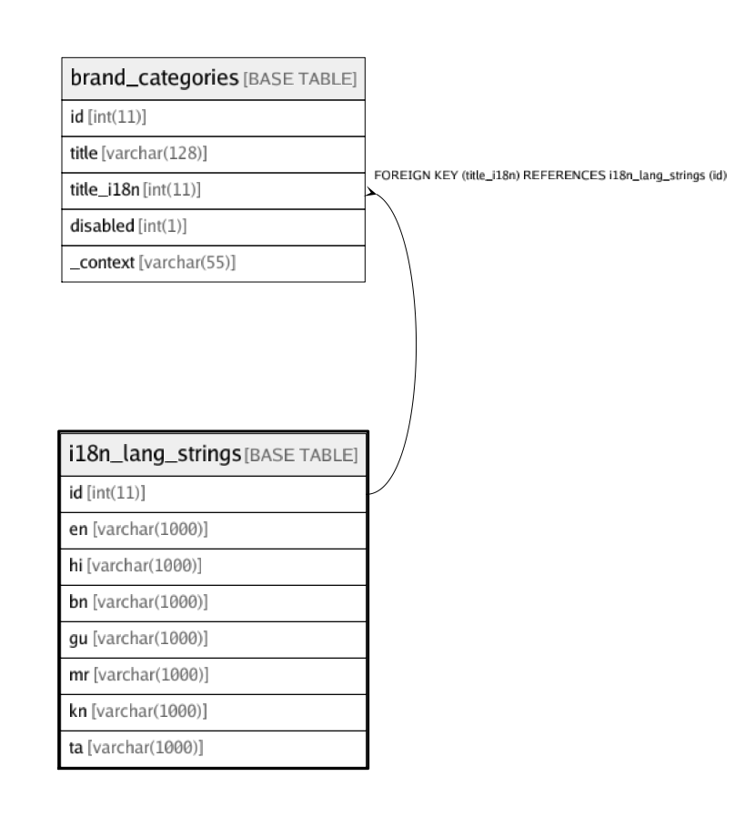

# i18n_lang_strings

## Description

<details>
<summary><strong>Table Definition</strong></summary>

```sql
CREATE TABLE `i18n_lang_strings` (
  `id` int(11) NOT NULL,
  `en` varchar(1000) CHARACTER SET utf8 COLLATE utf8_unicode_ci NOT NULL DEFAULT '' COMMENT 'English',
  `hi` varchar(1000) CHARACTER SET utf8 COLLATE utf8_unicode_ci NOT NULL DEFAULT '' COMMENT 'Hindi',
  `bn` varchar(1000) CHARACTER SET utf8 COLLATE utf8_unicode_ci NOT NULL DEFAULT '' COMMENT 'Bengali',
  `gu` varchar(1000) CHARACTER SET utf8 COLLATE utf8_unicode_ci NOT NULL DEFAULT '' COMMENT 'Gujarati',
  `mr` varchar(1000) CHARACTER SET utf8 COLLATE utf8_unicode_ci NOT NULL DEFAULT '' COMMENT 'Marathi',
  `kn` varchar(1000) CHARACTER SET utf8 COLLATE utf8_unicode_ci NOT NULL DEFAULT '' COMMENT 'Kannada',
  `ta` varchar(1000) CHARACTER SET utf8 COLLATE utf8_unicode_ci NOT NULL DEFAULT '' COMMENT 'Tamil',
  PRIMARY KEY (`id`),
  UNIQUE KEY `UniqueText` (`en`)
) ENGINE=InnoDB DEFAULT CHARSET=utf8 COLLATE=utf8_unicode_ci
```

</details>

## Columns

| Name | Type | Default | Nullable | Children | Parents | Comment |
| ---- | ---- | ------- | -------- | -------- | ------- | ------- |
| id | int(11) |  | false | [brand_categories](brand_categories.md) |  |  |
| en | varchar(1000) |  | false |  |  | English |
| hi | varchar(1000) |  | false |  |  | Hindi |
| bn | varchar(1000) |  | false |  |  | Bengali |
| gu | varchar(1000) |  | false |  |  | Gujarati |
| mr | varchar(1000) |  | false |  |  | Marathi |
| kn | varchar(1000) |  | false |  |  | Kannada |
| ta | varchar(1000) |  | false |  |  | Tamil |

## Constraints

| Name | Type | Definition |
| ---- | ---- | ---------- |
| PRIMARY | PRIMARY KEY | PRIMARY KEY (id) |
| UniqueText | UNIQUE | UNIQUE KEY UniqueText (en) |

## Indexes

| Name | Definition |
| ---- | ---------- |
| PRIMARY | PRIMARY KEY (id) USING BTREE |
| UniqueText | UNIQUE KEY UniqueText (en) USING BTREE |

## Relations



---

> Generated by [tbls](https://github.com/k1LoW/tbls)
