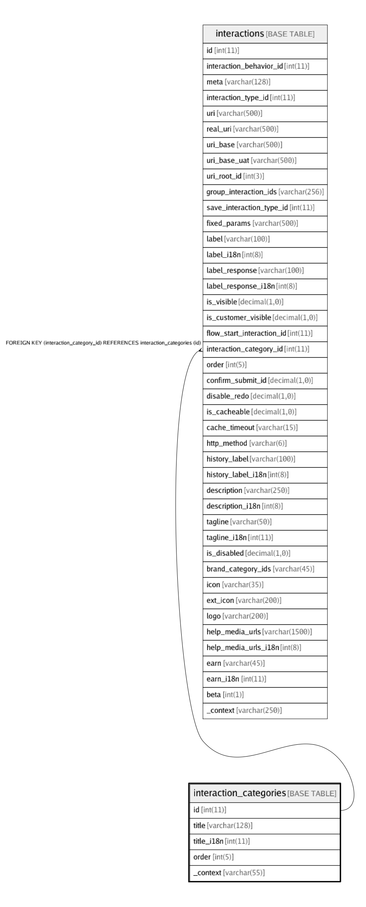

# interaction_categories

## Description

<details>
<summary><strong>Table Definition</strong></summary>

```sql
CREATE TABLE `interaction_categories` (
  `id` int(11) NOT NULL AUTO_INCREMENT,
  `title` varchar(128) CHARACTER SET utf8 COLLATE utf8_unicode_ci NOT NULL,
  `title_i18n` int(11) DEFAULT NULL,
  `order` int(5) NOT NULL DEFAULT '0' COMMENT 'Order in which the categories should be sorted',
  `_context` varchar(55) DEFAULT NULL COMMENT 'Comments/notes about the category',
  PRIMARY KEY (`id`)
) ENGINE=InnoDB AUTO_INCREMENT=23 DEFAULT CHARSET=latin1
```

</details>

## Columns

| Name | Type | Default | Nullable | Children | Parents | Comment |
| ---- | ---- | ------- | -------- | -------- | ------- | ------- |
| id | int(11) |  | false | [interactions](interactions.md) |  |  |
| title | varchar(128) |  | false |  |  |  |
| title_i18n | int(11) |  | true |  |  |  |
| order | int(5) | 0 | false |  |  | Order in which the categories should be sorted |
| _context | varchar(55) |  | true |  |  | Comments/notes about the category |

## Constraints

| Name | Type | Definition |
| ---- | ---- | ---------- |
| PRIMARY | PRIMARY KEY | PRIMARY KEY (id) |

## Indexes

| Name | Definition |
| ---- | ---------- |
| PRIMARY | PRIMARY KEY (id) USING BTREE |

## Relations



---

> Generated by [tbls](https://github.com/k1LoW/tbls)
