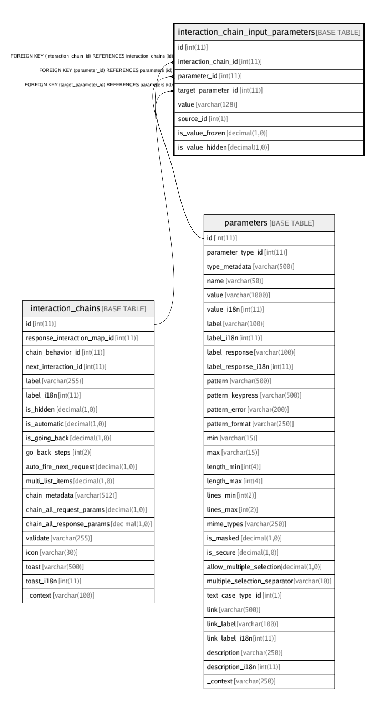

# interaction_chain_input_parameters

## Description

<details>
<summary><strong>Table Definition</strong></summary>

```sql
CREATE TABLE `interaction_chain_input_parameters` (
  `id` int(11) NOT NULL AUTO_INCREMENT,
  `interaction_chain_id` int(11) NOT NULL,
  `parameter_id` int(11) NOT NULL,
  `target_parameter_id` int(11) DEFAULT NULL COMMENT 'Destination parameter to copy the chained value to. If ''0'', the destination/target parameter should have the same name as source parameter',
  `value` varchar(128) NOT NULL DEFAULT '' COMMENT 'A default/fixed value for the chain, if parameter_source_id==0',
  `source_id` int(1) NOT NULL DEFAULT '1' COMMENT 'From interaction_chain_parameter_source table. 1=Response, 2=Request.',
  `is_value_frozen` decimal(1,0) NOT NULL DEFAULT '0' COMMENT 'If true, parameter value is copied but it is not editable',
  `is_value_hidden` decimal(1,0) NOT NULL DEFAULT '0' COMMENT 'If true, parameter value is copied but it is not visible on the UI',
  PRIMARY KEY (`id`),
  KEY `fk_chain_param_interaction_chain_id_index` (`interaction_chain_id`),
  KEY `fk_chain_param_parameter_id_index` (`parameter_id`),
  KEY `fk_chain_param_target_parameter_id_idx` (`target_parameter_id`),
  CONSTRAINT `fk_chain_param_interaction_chain_id` FOREIGN KEY (`interaction_chain_id`) REFERENCES `interaction_chains` (`id`) ON DELETE CASCADE ON UPDATE CASCADE,
  CONSTRAINT `fk_chain_param_parameter_id` FOREIGN KEY (`parameter_id`) REFERENCES `parameters` (`id`) ON DELETE CASCADE ON UPDATE CASCADE,
  CONSTRAINT `fk_chain_param_target_parameter_id` FOREIGN KEY (`target_parameter_id`) REFERENCES `parameters` (`id`) ON DELETE CASCADE ON UPDATE CASCADE
) ENGINE=InnoDB AUTO_INCREMENT=1985 DEFAULT CHARSET=latin1
```

</details>

## Columns

| Name | Type | Default | Nullable | Children | Parents | Comment |
| ---- | ---- | ------- | -------- | -------- | ------- | ------- |
| id | int(11) |  | false |  |  |  |
| interaction_chain_id | int(11) |  | false |  | [interaction_chains](interaction_chains.md) |  |
| parameter_id | int(11) |  | false |  | [parameters](parameters.md) |  |
| target_parameter_id | int(11) |  | true |  | [parameters](parameters.md) | Destination parameter to copy the chained value to. If '0', the destination/target parameter should have the same name as source parameter |
| value | varchar(128) |  | false |  |  | A default/fixed value for the chain, if parameter_source_id==0 |
| source_id | int(1) | 1 | false |  |  | From interaction_chain_parameter_source table. 1=Response, 2=Request. |
| is_value_frozen | decimal(1,0) | 0 | false |  |  | If true, parameter value is copied but it is not editable |
| is_value_hidden | decimal(1,0) | 0 | false |  |  | If true, parameter value is copied but it is not visible on the UI |

## Constraints

| Name | Type | Definition |
| ---- | ---- | ---------- |
| fk_chain_param_interaction_chain_id | FOREIGN KEY | FOREIGN KEY (interaction_chain_id) REFERENCES interaction_chains (id) |
| fk_chain_param_parameter_id | FOREIGN KEY | FOREIGN KEY (parameter_id) REFERENCES parameters (id) |
| fk_chain_param_target_parameter_id | FOREIGN KEY | FOREIGN KEY (target_parameter_id) REFERENCES parameters (id) |
| PRIMARY | PRIMARY KEY | PRIMARY KEY (id) |

## Indexes

| Name | Definition |
| ---- | ---------- |
| fk_chain_param_interaction_chain_id_index | KEY fk_chain_param_interaction_chain_id_index (interaction_chain_id) USING BTREE |
| fk_chain_param_parameter_id_index | KEY fk_chain_param_parameter_id_index (parameter_id) USING BTREE |
| fk_chain_param_target_parameter_id_idx | KEY fk_chain_param_target_parameter_id_idx (target_parameter_id) USING BTREE |
| PRIMARY | PRIMARY KEY (id) USING BTREE |

## Relations



---

> Generated by [tbls](https://github.com/k1LoW/tbls)
