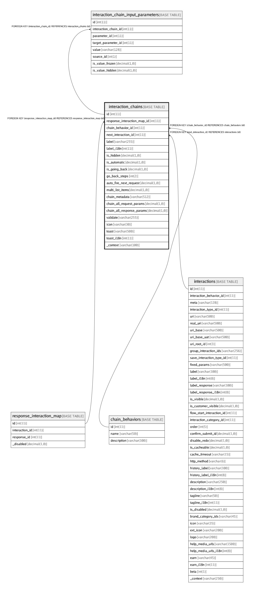

# interaction_chains

## Description

<details>
<summary><strong>Table Definition</strong></summary>

```sql
CREATE TABLE `interaction_chains` (
  `id` int(11) NOT NULL AUTO_INCREMENT,
  `response_interaction_map_id` int(11) NOT NULL,
  `chain_behavior_id` int(11) NOT NULL DEFAULT '1' COMMENT 'chain behavior if this will normal, external url, payment_gateway etc\n1=Normal Chain (Normal Chain for bi-directional linking tf-response with new tf-request)\n2=External URL (For opening external URL like shopping sites, sbi url for H2H etc)\n3=Payment Gatement (For bi-directional linking of tf-request,tf-response and external payment gateway website)',
  `next_interaction_id` int(11) NOT NULL,
  `label` varchar(255) CHARACTER SET utf8 COLLATE utf8_unicode_ci NOT NULL,
  `label_i18n` int(11) DEFAULT NULL,
  `is_hidden` decimal(1,0) NOT NULL DEFAULT '0' COMMENT 'Do not show the chain. It is activted automatically (maybe through Customer-Profile-Stub, etc.)',
  `is_automatic` decimal(1,0) NOT NULL DEFAULT '0' COMMENT 'Don''t ask/suggest; just goto the chained trxn (if True)',
  `is_going_back` decimal(1,0) NOT NULL DEFAULT '0' COMMENT 'Is the chain meant to go back to an EXISTING/VISIBLE REQUEST CARD (retry) in the interaction flow?',
  `go_back_steps` int(2) NOT NULL DEFAULT '0' COMMENT 'Manual number of steps to go-back (replace prev trxn boxes). If is_going_back is 1, ignore next_interaction_id (specially, if not found) and find next interaction card by going back the specified number of steps',
  `auto_fire_next_request` decimal(1,0) NOT NULL DEFAULT '0' COMMENT 'Automatically fire/submit the next chained request (Unless the user is going back to EDIT that request-card)',
  `multi_list_items` decimal(1,0) NOT NULL DEFAULT '0',
  `chain_metadata` varchar(512) NOT NULL DEFAULT '' COMMENT 'Chain multiple items from list (if any parameter chains to a list)? The corresponding list will give option to select multiple rows.',
  `chain_all_request_params` decimal(1,0) NOT NULL DEFAULT '0' COMMENT 'Chain all parameters from request card that match in name with next interaction request.\nis_frozen=0, is_hidden=0',
  `chain_all_response_params` decimal(1,0) NOT NULL DEFAULT '0' COMMENT 'Chain all parameters from response card that match in name with next interaction request.\nis_frozen=0, is_hidden=0',
  `validate` varchar(255) NOT NULL DEFAULT '' COMMENT 'Use an expression to evaluate the visibility of chain based on other parameters (in response).\nExpression example: [''&&'', [''=='', ''{a}'', ''{b}''], [''<'', ''{a}'', ''{c}'']]\n(I.e, Enable this chain when parameters a == b and a < c)',
  `icon` varchar(30) NOT NULL DEFAULT 'go' COMMENT 'icon for chain: go/repeat/refresh/back/add/remove/edit/etc.',
  `toast` varchar(500) CHARACTER SET utf8 COLLATE utf8_unicode_ci NOT NULL,
  `toast_i18n` int(11) DEFAULT NULL,
  `_context` varchar(100) DEFAULT NULL COMMENT 'After a request is loaded due to this chain, auto-fire it.',
  PRIMARY KEY (`id`),
  KEY `fk_chain_response_id_index` (`response_interaction_map_id`),
  KEY `fk_chain_next_interaction_id_index` (`next_interaction_id`),
  KEY `fk_interaction_chains_behavior_id_idx` (`chain_behavior_id`),
  CONSTRAINT `fk_chain_next_interaction_id` FOREIGN KEY (`next_interaction_id`) REFERENCES `interactions` (`id`) ON DELETE CASCADE ON UPDATE CASCADE,
  CONSTRAINT `fk_chain_response_interaction_map_id` FOREIGN KEY (`response_interaction_map_id`) REFERENCES `response_interaction_map` (`id`) ON DELETE CASCADE ON UPDATE CASCADE,
  CONSTRAINT `fk_interaction_chains_behavior_id` FOREIGN KEY (`chain_behavior_id`) REFERENCES `chain_behaviors` (`id`) ON DELETE CASCADE ON UPDATE CASCADE
) ENGINE=InnoDB AUTO_INCREMENT=844 DEFAULT CHARSET=latin1
```

</details>

## Columns

| Name | Type | Default | Nullable | Children | Parents | Comment |
| ---- | ---- | ------- | -------- | -------- | ------- | ------- |
| id | int(11) |  | false | [interaction_chain_input_parameters](interaction_chain_input_parameters.md) |  |  |
| response_interaction_map_id | int(11) |  | false |  | [response_interaction_map](response_interaction_map.md) |  |
| chain_behavior_id | int(11) | 1 | false |  | [chain_behaviors](chain_behaviors.md) | chain behavior if this will normal, external url, payment_gateway etc<br>1=Normal Chain (Normal Chain for bi-directional linking tf-response with new tf-request)<br>2=External URL (For opening external URL like shopping sites, sbi url for H2H etc)<br>3=Payment Gatement (For bi-directional linking of tf-request,tf-response and external payment gateway website) |
| next_interaction_id | int(11) |  | false |  | [interactions](interactions.md) |  |
| label | varchar(255) |  | false |  |  |  |
| label_i18n | int(11) |  | true |  |  |  |
| is_hidden | decimal(1,0) | 0 | false |  |  | Do not show the chain. It is activted automatically (maybe through Customer-Profile-Stub, etc.) |
| is_automatic | decimal(1,0) | 0 | false |  |  | Don't ask/suggest; just goto the chained trxn (if True) |
| is_going_back | decimal(1,0) | 0 | false |  |  | Is the chain meant to go back to an EXISTING/VISIBLE REQUEST CARD (retry) in the interaction flow? |
| go_back_steps | int(2) | 0 | false |  |  | Manual number of steps to go-back (replace prev trxn boxes). If is_going_back is 1, ignore next_interaction_id (specially, if not found) and find next interaction card by going back the specified number of steps |
| auto_fire_next_request | decimal(1,0) | 0 | false |  |  | Automatically fire/submit the next chained request (Unless the user is going back to EDIT that request-card) |
| multi_list_items | decimal(1,0) | 0 | false |  |  |  |
| chain_metadata | varchar(512) |  | false |  |  | Chain multiple items from list (if any parameter chains to a list)? The corresponding list will give option to select multiple rows. |
| chain_all_request_params | decimal(1,0) | 0 | false |  |  | Chain all parameters from request card that match in name with next interaction request.<br>is_frozen=0, is_hidden=0 |
| chain_all_response_params | decimal(1,0) | 0 | false |  |  | Chain all parameters from response card that match in name with next interaction request.<br>is_frozen=0, is_hidden=0 |
| validate | varchar(255) |  | false |  |  | Use an expression to evaluate the visibility of chain based on other parameters (in response).<br>Expression example: ['&&', ['==', '{a}', '{b}'], ['<', '{a}', '{c}']]<br>(I.e, Enable this chain when parameters a == b and a < c) |
| icon | varchar(30) | go | false |  |  | icon for chain: go/repeat/refresh/back/add/remove/edit/etc. |
| toast | varchar(500) |  | false |  |  |  |
| toast_i18n | int(11) |  | true |  |  |  |
| _context | varchar(100) |  | true |  |  | After a request is loaded due to this chain, auto-fire it. |

## Constraints

| Name | Type | Definition |
| ---- | ---- | ---------- |
| fk_chain_next_interaction_id | FOREIGN KEY | FOREIGN KEY (next_interaction_id) REFERENCES interactions (id) |
| fk_chain_response_interaction_map_id | FOREIGN KEY | FOREIGN KEY (response_interaction_map_id) REFERENCES response_interaction_map (id) |
| fk_interaction_chains_behavior_id | FOREIGN KEY | FOREIGN KEY (chain_behavior_id) REFERENCES chain_behaviors (id) |
| PRIMARY | PRIMARY KEY | PRIMARY KEY (id) |

## Indexes

| Name | Definition |
| ---- | ---------- |
| fk_chain_next_interaction_id_index | KEY fk_chain_next_interaction_id_index (next_interaction_id) USING BTREE |
| fk_chain_response_id_index | KEY fk_chain_response_id_index (response_interaction_map_id) USING BTREE |
| fk_interaction_chains_behavior_id_idx | KEY fk_interaction_chains_behavior_id_idx (chain_behavior_id) USING BTREE |
| PRIMARY | PRIMARY KEY (id) USING BTREE |

## Relations



---

> Generated by [tbls](https://github.com/k1LoW/tbls)
