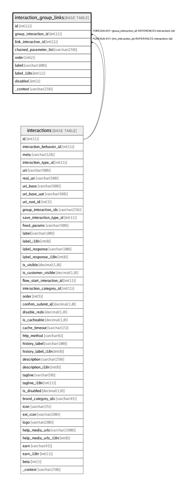

# interaction_group_links

## Description

<details>
<summary><strong>Table Definition</strong></summary>

```sql
CREATE TABLE `interaction_group_links` (
  `id` int(11) NOT NULL AUTO_INCREMENT,
  `group_interaction_id` int(11) NOT NULL COMMENT 'Source interaction_id',
  `link_interaction_id` int(11) NOT NULL COMMENT 'Destination link interaction_id',
  `chained_parameter_list` varchar(250) DEFAULT NULL COMMENT 'Array of parameter objects to chain on link-click\nEg: [{"name":"mobile", "value":"5464564564", "is_frozen":1}]',
  `order` int(2) NOT NULL DEFAULT '0',
  `label` varchar(100) DEFAULT NULL COMMENT 'Force alternate label',
  `label_i18n` int(11) DEFAULT NULL,
  `disabled` int(1) NOT NULL DEFAULT '0',
  `_context` varchar(250) DEFAULT NULL,
  PRIMARY KEY (`id`),
  KEY `fk_interaction_group_links_gr_idx` (`group_interaction_id`),
  KEY `fk_interaction_group_links_ln_idx` (`link_interaction_id`),
  CONSTRAINT `fk_interaction_group_links_gr` FOREIGN KEY (`group_interaction_id`) REFERENCES `interactions` (`id`) ON DELETE CASCADE ON UPDATE CASCADE,
  CONSTRAINT `fk_interaction_group_links_ln` FOREIGN KEY (`link_interaction_id`) REFERENCES `interactions` (`id`) ON DELETE CASCADE ON UPDATE CASCADE
) ENGINE=InnoDB AUTO_INCREMENT=12 DEFAULT CHARSET=latin1
```

</details>

## Columns

| Name | Type | Default | Nullable | Children | Parents | Comment |
| ---- | ---- | ------- | -------- | -------- | ------- | ------- |
| id | int(11) |  | false |  |  |  |
| group_interaction_id | int(11) |  | false |  | [interactions](interactions.md) | Source interaction_id |
| link_interaction_id | int(11) |  | false |  | [interactions](interactions.md) | Destination link interaction_id |
| chained_parameter_list | varchar(250) |  | true |  |  | Array of parameter objects to chain on link-click<br>Eg: [{"name":"mobile", "value":"5464564564", "is_frozen":1}] |
| order | int(2) | 0 | false |  |  |  |
| label | varchar(100) |  | true |  |  | Force alternate label |
| label_i18n | int(11) |  | true |  |  |  |
| disabled | int(1) | 0 | false |  |  |  |
| _context | varchar(250) |  | true |  |  |  |

## Constraints

| Name | Type | Definition |
| ---- | ---- | ---------- |
| fk_interaction_group_links_gr | FOREIGN KEY | FOREIGN KEY (group_interaction_id) REFERENCES interactions (id) |
| fk_interaction_group_links_ln | FOREIGN KEY | FOREIGN KEY (link_interaction_id) REFERENCES interactions (id) |
| PRIMARY | PRIMARY KEY | PRIMARY KEY (id) |

## Indexes

| Name | Definition |
| ---- | ---------- |
| fk_interaction_group_links_gr_idx | KEY fk_interaction_group_links_gr_idx (group_interaction_id) USING BTREE |
| fk_interaction_group_links_ln_idx | KEY fk_interaction_group_links_ln_idx (link_interaction_id) USING BTREE |
| PRIMARY | PRIMARY KEY (id) USING BTREE |

## Relations



---

> Generated by [tbls](https://github.com/k1LoW/tbls)
