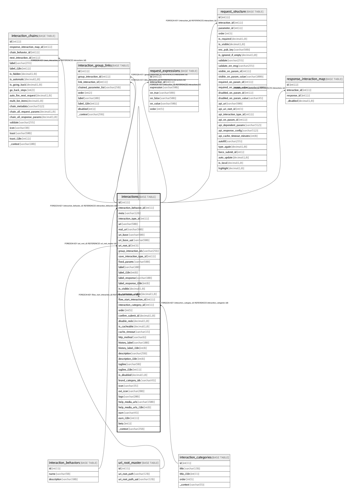

# interactions

## Description

<details>
<summary><strong>Table Definition</strong></summary>

```sql
CREATE TABLE `interactions` (
  `id` int(11) NOT NULL AUTO_INCREMENT,
  `interaction_behavior_id` int(11) NOT NULL DEFAULT '1' COMMENT 'interaction behavior if this will normal, local etc\n1=Normal Interaction (request SimpliBank)\n2=Flow\n3=Local Interaction (no server request. Use default response set in database)',
  `meta` varchar(128) COLLATE utf8_unicode_ci DEFAULT NULL COMMENT 'Metadata as JSON formatted String. {    "is_store":1,    // Treat as EkoStore   }',
  `interaction_type_id` int(11) DEFAULT NULL COMMENT 'Code to uniquely identify a transaction for a developer',
  `uri` varchar(500) CHARACTER SET utf8 COLLATE utf8_general_ci DEFAULT NULL COMMENT 'RESTful URI path endpoint for the interaction. May contain parameter_name variables under curly brackets to be replaced by actual parameter values.\nEg: /customers/mobile_number:{customer_id}\n',
  `real_uri` varchar(500) CHARACTER SET utf8 COLLATE utf8_general_ci DEFAULT NULL COMMENT 'Actual Simplibank URI path endpoint. Eg: For gateway, the request first goes to Gateway tnd then to Simplibank. \nThe ''uri'' contains Gateway endpoint whereas the ''real_uri'' contains the Simplibank endpoint',
  `uri_base` varchar(500) CHARACTER SET utf8 COLLATE utf8_general_ci DEFAULT NULL COMMENT 'URI Base of the API, if other than Simplibank. For example, Gateway or any other external service that we are using directly from Connect',
  `uri_base_uat` varchar(500) CHARACTER SET utf8 COLLATE utf8_general_ci DEFAULT NULL COMMENT 'URI Base of the API for UAT, if other than Simplibank. For example, Gateway or any other external service that we are using directly from Connect',
  `uri_root_id` int(3) NOT NULL DEFAULT '0' COMMENT 'ID representing a different API URI root path to use. Eg: 1 = "/payment-collection/api/v1"',
  `group_interaction_ids` varchar(256) CHARACTER SET utf8 COLLATE utf8_general_ci NOT NULL DEFAULT '' COMMENT 'A set of comma-separated interaction_ids that are to be shown in the GROUP (Tab-like interface on Connect). Eg: Manage My Account',
  `save_interaction_type_id` int(11) NOT NULL DEFAULT '0' COMMENT 'List of interaction_ids if it is an interaction of type GROUP. Show a menu of multiple interactions.',
  `fixed_params` varchar(500) CHARACTER SET utf8 COLLATE utf8_unicode_ci NOT NULL DEFAULT '' COMMENT 'JSON Object containing fixed parameters to introduce in the transaction request. Mostly useful with transaction flows.\nEg: {"is_kyc_mandetory":1}',
  `label` varchar(100) CHARACTER SET utf8 COLLATE utf8_unicode_ci NOT NULL,
  `label_i18n` int(8) DEFAULT NULL,
  `label_response` varchar(100) CHARACTER SET utf8 COLLATE utf8_unicode_ci NOT NULL,
  `label_response_i18n` int(8) DEFAULT NULL,
  `is_visible` decimal(1,0) NOT NULL DEFAULT '1' COMMENT 'Should it be shown directly on main UI? If not, it will only be visible through an Interaction-Chain',
  `is_customer_visible` decimal(1,0) NOT NULL DEFAULT '0' COMMENT 'Is visible in CustaView (to the customer-facing screen)?',
  `flow_start_interaction_id` int(11) DEFAULT NULL COMMENT 'id of the first Interaction to start the work-flow with. (eg: Get-Registered-Recipient''s-List in Send-Money)',
  `interaction_category_id` int(11) DEFAULT NULL COMMENT 'id of a category (from INTERACTION_CATEGORIES table) to which this interaction belongs',
  `order` int(5) NOT NULL DEFAULT '0' COMMENT 'Sort order for interactions',
  `confirm_submit_id` decimal(1,0) NOT NULL DEFAULT '0' COMMENT 'Show a confirmation dialog before submitting request?\n0: No\n1: Yes. "Are You Sure?"\n2: Yes. "I Agree"',
  `disable_redo` decimal(1,0) NOT NULL DEFAULT '0' COMMENT 'Disable the transaction to be edited and retried (after going back to request card)?',
  `is_cacheable` decimal(1,0) NOT NULL DEFAULT '0' COMMENT 'Can the response be cached?',
  `cache_timeout` varchar(15) CHARACTER SET utf8 COLLATE utf8_unicode_ci DEFAULT NULL COMMENT '0=Infinite, D=Day, M=Month, Y=Year. E.g: 0 / 1D / 2M / 4Y etc.',
  `http_method` varchar(6) CHARACTER SET utf8 COLLATE utf8_unicode_ci NOT NULL DEFAULT 'POST' COMMENT 'GET / POST / PUT / DELETE',
  `history_label` varchar(100) CHARACTER SET utf8 COLLATE utf8_unicode_ci NOT NULL COMMENT 'How to represent the response of this transaction in History.',
  `history_label_i18n` int(8) DEFAULT NULL,
  `description` varchar(250) CHARACTER SET utf8 COLLATE utf8_unicode_ci NOT NULL,
  `description_i18n` int(8) DEFAULT NULL,
  `tagline` varchar(50) CHARACTER SET utf8 COLLATE utf8_unicode_ci NOT NULL DEFAULT '' COMMENT 'Short tagline/description',
  `tagline_i18n` int(11) DEFAULT NULL,
  `is_disabled` decimal(1,0) NOT NULL DEFAULT '0',
  `brand_category_ids` varchar(45) CHARACTER SET utf8 COLLATE utf8_general_ci NOT NULL DEFAULT '' COMMENT 'Comma separated list of IDs (from table brand_categories) that define which Store Category the brand/service belongs to',
  `icon` varchar(35) CHARACTER SET utf8 COLLATE utf8_unicode_ci NOT NULL DEFAULT '' COMMENT 'Name of an icon as per the Material Design Icons list',
  `ext_icon` varchar(200) CHARACTER SET utf8 COLLATE utf8_unicode_ci NOT NULL DEFAULT '' COMMENT 'External Icon URI for the Product/Brand',
  `logo` varchar(200) CHARACTER SET utf8 COLLATE utf8_general_ci NOT NULL DEFAULT '' COMMENT 'LOGO / Branding image absolute URI to show on top-right side of request cards. MAX-HEIGHT: 50px',
  `help_media_urls` varchar(1500) CHARACTER SET utf8 COLLATE utf8_unicode_ci DEFAULT NULL COMMENT 'Comma separated list of media URLs providing help/walkthrough for this transaction. It could be\n1. image URL\n2. Full URL for help document (usually a public Google doc)\n3. video-ID of a Youtube video',
  `help_media_urls_i18n` int(8) DEFAULT NULL,
  `earn` varchar(45) CHARACTER SET utf8 COLLATE utf8_unicode_ci NOT NULL DEFAULT '' COMMENT 'How much a merchant will earn from this product',
  `earn_i18n` int(11) DEFAULT NULL,
  `beta` int(1) NOT NULL DEFAULT '0' COMMENT '1 = beta feature',
  `_context` varchar(250) CHARACTER SET latin1 COLLATE latin1_swedish_ci DEFAULT NULL COMMENT 'Comment about interaction for interrnal reference',
  PRIMARY KEY (`id`),
  KEY `fk_interactions_flow_start_interaction_id_idx` (`flow_start_interaction_id`),
  KEY `fk_interactions_interaction_category_id_idx` (`interaction_category_id`),
  KEY `fk_interaction_type_id_idx` (`interaction_type_id`),
  KEY `fk_interactions_interaction_behavior_id_idx` (`interaction_behavior_id`),
  KEY `fk_interactions_uri_root_id_idx` (`uri_root_id`),
  CONSTRAINT `fk_interactions_flow_start_interaction_id` FOREIGN KEY (`flow_start_interaction_id`) REFERENCES `interactions` (`id`) ON DELETE CASCADE ON UPDATE CASCADE,
  CONSTRAINT `fk_interactions_interaction_behavior_id` FOREIGN KEY (`interaction_behavior_id`) REFERENCES `interaction_behaviors` (`id`) ON DELETE CASCADE ON UPDATE CASCADE,
  CONSTRAINT `fk_interactions_interaction_category_id` FOREIGN KEY (`interaction_category_id`) REFERENCES `interaction_categories` (`id`) ON DELETE CASCADE ON UPDATE CASCADE,
  CONSTRAINT `fk_interactions_uri_root_id` FOREIGN KEY (`uri_root_id`) REFERENCES `uri_root_master` (`id`) ON UPDATE CASCADE
) ENGINE=InnoDB AUTO_INCREMENT=605 DEFAULT CHARSET=utf8 COLLATE=utf8_unicode_ci
```

</details>

## Columns

| Name | Type | Default | Nullable | Children | Parents | Comment |
| ---- | ---- | ------- | -------- | -------- | ------- | ------- |
| id | int(11) |  | false | [interaction_chains](interaction_chains.md) [interaction_group_links](interaction_group_links.md) [interactions](interactions.md) [request_expressions](request_expressions.md) [request_structure](request_structure.md) [response_interaction_map](response_interaction_map.md) |  |  |
| interaction_behavior_id | int(11) | 1 | false |  | [interaction_behaviors](interaction_behaviors.md) | interaction behavior if this will normal, local etc<br>1=Normal Interaction (request SimpliBank)<br>2=Flow<br>3=Local Interaction (no server request. Use default response set in database) |
| meta | varchar(128) |  | true |  |  | Metadata as JSON formatted String. {    "is_store":1,    // Treat as EkoStore   } |
| interaction_type_id | int(11) |  | true |  |  | Code to uniquely identify a transaction for a developer |
| uri | varchar(500) |  | true |  |  | RESTful URI path endpoint for the interaction. May contain parameter_name variables under curly brackets to be replaced by actual parameter values.<br>Eg: /customers/mobile_number:{customer_id}<br> |
| real_uri | varchar(500) |  | true |  |  | Actual Simplibank URI path endpoint. Eg: For gateway, the request first goes to Gateway tnd then to Simplibank. <br>The 'uri' contains Gateway endpoint whereas the 'real_uri' contains the Simplibank endpoint |
| uri_base | varchar(500) |  | true |  |  | URI Base of the API, if other than Simplibank. For example, Gateway or any other external service that we are using directly from Connect |
| uri_base_uat | varchar(500) |  | true |  |  | URI Base of the API for UAT, if other than Simplibank. For example, Gateway or any other external service that we are using directly from Connect |
| uri_root_id | int(3) | 0 | false |  | [uri_root_master](uri_root_master.md) | ID representing a different API URI root path to use. Eg: 1 = "/payment-collection/api/v1" |
| group_interaction_ids | varchar(256) |  | false |  |  | A set of comma-separated interaction_ids that are to be shown in the GROUP (Tab-like interface on Connect). Eg: Manage My Account |
| save_interaction_type_id | int(11) | 0 | false |  |  | List of interaction_ids if it is an interaction of type GROUP. Show a menu of multiple interactions. |
| fixed_params | varchar(500) |  | false |  |  | JSON Object containing fixed parameters to introduce in the transaction request. Mostly useful with transaction flows.<br>Eg: {"is_kyc_mandetory":1} |
| label | varchar(100) |  | false |  |  |  |
| label_i18n | int(8) |  | true |  |  |  |
| label_response | varchar(100) |  | false |  |  |  |
| label_response_i18n | int(8) |  | true |  |  |  |
| is_visible | decimal(1,0) | 1 | false |  |  | Should it be shown directly on main UI? If not, it will only be visible through an Interaction-Chain |
| is_customer_visible | decimal(1,0) | 0 | false |  |  | Is visible in CustaView (to the customer-facing screen)? |
| flow_start_interaction_id | int(11) |  | true |  | [interactions](interactions.md) | id of the first Interaction to start the work-flow with. (eg: Get-Registered-Recipient's-List in Send-Money) |
| interaction_category_id | int(11) |  | true |  | [interaction_categories](interaction_categories.md) | id of a category (from INTERACTION_CATEGORIES table) to which this interaction belongs |
| order | int(5) | 0 | false |  |  | Sort order for interactions |
| confirm_submit_id | decimal(1,0) | 0 | false |  |  | Show a confirmation dialog before submitting request?<br>0: No<br>1: Yes. "Are You Sure?"<br>2: Yes. "I Agree" |
| disable_redo | decimal(1,0) | 0 | false |  |  | Disable the transaction to be edited and retried (after going back to request card)? |
| is_cacheable | decimal(1,0) | 0 | false |  |  | Can the response be cached? |
| cache_timeout | varchar(15) |  | true |  |  | 0=Infinite, D=Day, M=Month, Y=Year. E.g: 0 / 1D / 2M / 4Y etc. |
| http_method | varchar(6) | POST | false |  |  | GET / POST / PUT / DELETE |
| history_label | varchar(100) |  | false |  |  | How to represent the response of this transaction in History. |
| history_label_i18n | int(8) |  | true |  |  |  |
| description | varchar(250) |  | false |  |  |  |
| description_i18n | int(8) |  | true |  |  |  |
| tagline | varchar(50) |  | false |  |  | Short tagline/description |
| tagline_i18n | int(11) |  | true |  |  |  |
| is_disabled | decimal(1,0) | 0 | false |  |  |  |
| brand_category_ids | varchar(45) |  | false |  |  | Comma separated list of IDs (from table brand_categories) that define which Store Category the brand/service belongs to |
| icon | varchar(35) |  | false |  |  | Name of an icon as per the Material Design Icons list |
| ext_icon | varchar(200) |  | false |  |  | External Icon URI for the Product/Brand |
| logo | varchar(200) |  | false |  |  | LOGO / Branding image absolute URI to show on top-right side of request cards. MAX-HEIGHT: 50px |
| help_media_urls | varchar(1500) |  | true |  |  | Comma separated list of media URLs providing help/walkthrough for this transaction. It could be<br>1. image URL<br>2. Full URL for help document (usually a public Google doc)<br>3. video-ID of a Youtube video |
| help_media_urls_i18n | int(8) |  | true |  |  |  |
| earn | varchar(45) |  | false |  |  | How much a merchant will earn from this product |
| earn_i18n | int(11) |  | true |  |  |  |
| beta | int(1) | 0 | false |  |  | 1 = beta feature |
| _context | varchar(250) |  | true |  |  | Comment about interaction for interrnal reference |

## Constraints

| Name | Type | Definition |
| ---- | ---- | ---------- |
| fk_interactions_flow_start_interaction_id | FOREIGN KEY | FOREIGN KEY (flow_start_interaction_id) REFERENCES interactions (id) |
| fk_interactions_interaction_behavior_id | FOREIGN KEY | FOREIGN KEY (interaction_behavior_id) REFERENCES interaction_behaviors (id) |
| fk_interactions_interaction_category_id | FOREIGN KEY | FOREIGN KEY (interaction_category_id) REFERENCES interaction_categories (id) |
| fk_interactions_uri_root_id | FOREIGN KEY | FOREIGN KEY (uri_root_id) REFERENCES uri_root_master (id) |
| PRIMARY | PRIMARY KEY | PRIMARY KEY (id) |

## Indexes

| Name | Definition |
| ---- | ---------- |
| fk_interaction_type_id_idx | KEY fk_interaction_type_id_idx (interaction_type_id) USING BTREE |
| fk_interactions_flow_start_interaction_id_idx | KEY fk_interactions_flow_start_interaction_id_idx (flow_start_interaction_id) USING BTREE |
| fk_interactions_interaction_behavior_id_idx | KEY fk_interactions_interaction_behavior_id_idx (interaction_behavior_id) USING BTREE |
| fk_interactions_interaction_category_id_idx | KEY fk_interactions_interaction_category_id_idx (interaction_category_id) USING BTREE |
| fk_interactions_uri_root_id_idx | KEY fk_interactions_uri_root_id_idx (uri_root_id) USING BTREE |
| PRIMARY | PRIMARY KEY (id) USING BTREE |

## Relations



---

> Generated by [tbls](https://github.com/k1LoW/tbls)
