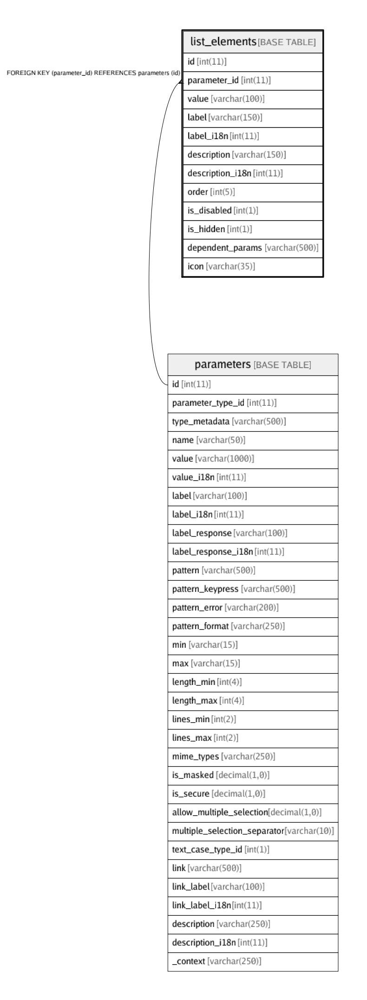

# list_elements

## Description

<details>
<summary><strong>Table Definition</strong></summary>

```sql
CREATE TABLE `list_elements` (
  `id` int(11) NOT NULL AUTO_INCREMENT,
  `parameter_id` int(11) NOT NULL,
  `value` varchar(100) CHARACTER SET utf8 COLLATE utf8_general_ci NOT NULL,
  `label` varchar(150) CHARACTER SET utf8 COLLATE utf8_unicode_ci NOT NULL,
  `label_i18n` int(11) DEFAULT NULL,
  `description` varchar(150) CHARACTER SET utf8 COLLATE utf8_unicode_ci NOT NULL,
  `description_i18n` int(11) DEFAULT NULL,
  `order` int(5) NOT NULL DEFAULT '0',
  `is_disabled` int(1) NOT NULL DEFAULT '0',
  `is_hidden` int(1) NOT NULL DEFAULT '0',
  `dependent_params` varchar(500) CHARACTER SET utf8 COLLATE utf8_unicode_ci NOT NULL DEFAULT '[]' COMMENT 'Change properties of another parameter when this list-element is selected.\\nEg: [{"name":"amount","postfix":100,"pattern":"^[0-9]*100$","pattern_error":"Amount must end with 100"}]',
  `icon` varchar(35) CHARACTER SET latin1 COLLATE latin1_swedish_ci NOT NULL DEFAULT '' COMMENT 'Name of an icon as per the Material Design Icons list',
  PRIMARY KEY (`id`),
  KEY `fk_list_element_parameter_id_index` (`parameter_id`),
  CONSTRAINT `fk_list_element_parameter_id` FOREIGN KEY (`parameter_id`) REFERENCES `parameters` (`id`) ON DELETE CASCADE ON UPDATE CASCADE
) ENGINE=InnoDB AUTO_INCREMENT=742 DEFAULT CHARSET=utf8 COLLATE=utf8_unicode_ci
```

</details>

## Columns

| Name | Type | Default | Nullable | Children | Parents | Comment |
| ---- | ---- | ------- | -------- | -------- | ------- | ------- |
| id | int(11) |  | false |  |  |  |
| parameter_id | int(11) |  | false |  | [parameters](parameters.md) |  |
| value | varchar(100) |  | false |  |  |  |
| label | varchar(150) |  | false |  |  |  |
| label_i18n | int(11) |  | true |  |  |  |
| description | varchar(150) |  | false |  |  |  |
| description_i18n | int(11) |  | true |  |  |  |
| order | int(5) | 0 | false |  |  |  |
| is_disabled | int(1) | 0 | false |  |  |  |
| is_hidden | int(1) | 0 | false |  |  |  |
| dependent_params | varchar(500) | [] | false |  |  | Change properties of another parameter when this list-element is selected.\nEg: [{"name":"amount","postfix":100,"pattern":"^[0-9]*100$","pattern_error":"Amount must end with 100"}] |
| icon | varchar(35) |  | false |  |  | Name of an icon as per the Material Design Icons list |

## Constraints

| Name | Type | Definition |
| ---- | ---- | ---------- |
| fk_list_element_parameter_id | FOREIGN KEY | FOREIGN KEY (parameter_id) REFERENCES parameters (id) |
| PRIMARY | PRIMARY KEY | PRIMARY KEY (id) |

## Indexes

| Name | Definition |
| ---- | ---------- |
| fk_list_element_parameter_id_index | KEY fk_list_element_parameter_id_index (parameter_id) USING BTREE |
| PRIMARY | PRIMARY KEY (id) USING BTREE |

## Relations



---

> Generated by [tbls](https://github.com/k1LoW/tbls)
