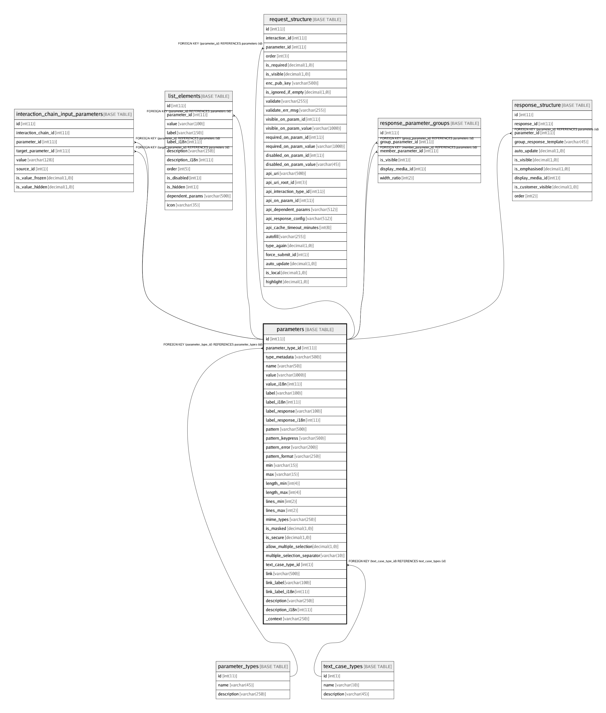

# parameters

## Description

<details>
<summary><strong>Table Definition</strong></summary>

```sql
CREATE TABLE `parameters` (
  `id` int(11) NOT NULL AUTO_INCREMENT,
  `parameter_type_id` int(11) NOT NULL,
  `type_metadata` varchar(500) CHARACTER SET latin1 COLLATE latin1_swedish_ci DEFAULT NULL COMMENT 'Extra info about some parameter types.\nDateTime format (eg: ddMMyyyy), Currency code (eg: INR) etc.\nDateTime format specified as Java SimpleDateFormat specifiers (http://developer.android.com/reference/java/text/SimpleDateFormat.html).',
  `name` varchar(50) CHARACTER SET latin1 COLLATE latin1_swedish_ci DEFAULT '' COMMENT 'Parameter name to be sent as name/value pair to the server. If blank, the parameter is not sent to the server.',
  `value` varchar(1000) CHARACTER SET utf8 COLLATE utf8_unicode_ci NOT NULL,
  `value_i18n` int(11) DEFAULT NULL,
  `label` varchar(100) CHARACTER SET utf8 COLLATE utf8_unicode_ci NOT NULL,
  `label_i18n` int(11) DEFAULT NULL,
  `label_response` varchar(100) CHARACTER SET utf8 COLLATE utf8_unicode_ci NOT NULL,
  `label_response_i18n` int(11) DEFAULT NULL,
  `pattern` varchar(500) CHARACTER SET utf8 COLLATE utf8_unicode_ci NOT NULL,
  `pattern_keypress` varchar(500) CHARACTER SET utf8 COLLATE utf8_unicode_ci NOT NULL,
  `pattern_error` varchar(200) CHARACTER SET latin1 COLLATE latin1_swedish_ci DEFAULT NULL COMMENT 'Error message in case the user entry does not match the valid regex pattern',
  `pattern_format` varchar(250) CHARACTER SET latin1 COLLATE latin1_swedish_ci DEFAULT NULL,
  `min` varchar(15) CHARACTER SET latin1 COLLATE latin1_swedish_ci NOT NULL DEFAULT '0' COMMENT 'Minimum value for validation of Numeric/Money/DateTime types.\nFor DateTime: specify range in D=Days (default), W=Weeks, M=Months, Y=Years, etc.\nEg: Min=-3 and Max=0 means from 3 days ago to Today (0)',
  `max` varchar(15) CHARACTER SET latin1 COLLATE latin1_swedish_ci NOT NULL DEFAULT '0' COMMENT 'Maximum value for validation of Numeric/Money/DateTime types.\nFor DateTime: specify range in D=Days (default), W=Weeks, M=Months, Y=Years, etc.\nEg: Min=-3 and Max=0 means from 3 days ago to Today (0)',
  `length_min` int(4) NOT NULL DEFAULT '0',
  `length_max` int(4) NOT NULL DEFAULT '250',
  `lines_min` int(2) NOT NULL DEFAULT '0' COMMENT 'For multi-line text input field',
  `lines_max` int(2) NOT NULL DEFAULT '0' COMMENT 'For multi-line text input field',
  `mime_types` varchar(250) CHARACTER SET latin1 COLLATE latin1_swedish_ci NOT NULL COMMENT 'Accepted mime-types for RAW data (file upload)',
  `is_masked` decimal(1,0) NOT NULL DEFAULT '0' COMMENT 'Mask field with * (eg: for Password field) ',
  `is_secure` decimal(1,0) NOT NULL DEFAULT '0' COMMENT 'Handle data securely. Do not cache.',
  `allow_multiple_selection` decimal(1,0) NOT NULL DEFAULT '0' COMMENT 'Allow multi-select in a LIST type parameter',
  `multiple_selection_separator` varchar(10) CHARACTER SET latin1 COLLATE latin1_swedish_ci NOT NULL COMMENT 'To separate multiple items when (for multi-select list)',
  `text_case_type_id` int(1) NOT NULL DEFAULT '0' COMMENT '0:default, 1:upper, 2:lower, 3:camel, 4:sentence',
  `link` varchar(500) CHARACTER SET latin1 COLLATE latin1_swedish_ci NOT NULL COMMENT 'Any external URL to show with the parameter. Eg: Show link for Aadhaar/Voter-card Verification sites.\nValue in <label>|<url> format. Eg: Verify|https://eaadhaar.uidai.gov.in',
  `link_label` varchar(100) COLLATE utf8_unicode_ci DEFAULT NULL,
  `link_label_i18n` int(11) DEFAULT NULL,
  `description` varchar(250) CHARACTER SET utf8 COLLATE utf8_unicode_ci NOT NULL,
  `description_i18n` int(11) DEFAULT NULL,
  `_context` varchar(250) CHARACTER SET latin1 COLLATE latin1_swedish_ci DEFAULT NULL COMMENT 'Any comment for internal development usage',
  PRIMARY KEY (`id`),
  KEY `fk_parameter_type_id_index` (`parameter_type_id`),
  KEY `fk_parameters_text_case_type_id_idx` (`text_case_type_id`),
  CONSTRAINT `fk_parameter_type_id` FOREIGN KEY (`parameter_type_id`) REFERENCES `parameter_types` (`id`) ON DELETE CASCADE ON UPDATE CASCADE,
  CONSTRAINT `fk_parameters_text_case_type_id` FOREIGN KEY (`text_case_type_id`) REFERENCES `text_case_types` (`id`) ON DELETE CASCADE ON UPDATE CASCADE
) ENGINE=InnoDB AUTO_INCREMENT=1457 DEFAULT CHARSET=utf8 COLLATE=utf8_unicode_ci
```

</details>

## Columns

| Name | Type | Default | Nullable | Children | Parents | Comment |
| ---- | ---- | ------- | -------- | -------- | ------- | ------- |
| id | int(11) |  | false | [interaction_chain_input_parameters](interaction_chain_input_parameters.md) [list_elements](list_elements.md) [request_structure](request_structure.md) [response_parameter_groups](response_parameter_groups.md) [response_structure](response_structure.md) |  |  |
| parameter_type_id | int(11) |  | false |  | [parameter_types](parameter_types.md) |  |
| type_metadata | varchar(500) |  | true |  |  | Extra info about some parameter types.<br>DateTime format (eg: ddMMyyyy), Currency code (eg: INR) etc.<br>DateTime format specified as Java SimpleDateFormat specifiers (http://developer.android.com/reference/java/text/SimpleDateFormat.html). |
| name | varchar(50) |  | true |  |  | Parameter name to be sent as name/value pair to the server. If blank, the parameter is not sent to the server. |
| value | varchar(1000) |  | false |  |  |  |
| value_i18n | int(11) |  | true |  |  |  |
| label | varchar(100) |  | false |  |  |  |
| label_i18n | int(11) |  | true |  |  |  |
| label_response | varchar(100) |  | false |  |  |  |
| label_response_i18n | int(11) |  | true |  |  |  |
| pattern | varchar(500) |  | false |  |  |  |
| pattern_keypress | varchar(500) |  | false |  |  |  |
| pattern_error | varchar(200) |  | true |  |  | Error message in case the user entry does not match the valid regex pattern |
| pattern_format | varchar(250) |  | true |  |  |  |
| min | varchar(15) | 0 | false |  |  | Minimum value for validation of Numeric/Money/DateTime types.<br>For DateTime: specify range in D=Days (default), W=Weeks, M=Months, Y=Years, etc.<br>Eg: Min=-3 and Max=0 means from 3 days ago to Today (0) |
| max | varchar(15) | 0 | false |  |  | Maximum value for validation of Numeric/Money/DateTime types.<br>For DateTime: specify range in D=Days (default), W=Weeks, M=Months, Y=Years, etc.<br>Eg: Min=-3 and Max=0 means from 3 days ago to Today (0) |
| length_min | int(4) | 0 | false |  |  |  |
| length_max | int(4) | 250 | false |  |  |  |
| lines_min | int(2) | 0 | false |  |  | For multi-line text input field |
| lines_max | int(2) | 0 | false |  |  | For multi-line text input field |
| mime_types | varchar(250) |  | false |  |  | Accepted mime-types for RAW data (file upload) |
| is_masked | decimal(1,0) | 0 | false |  |  | Mask field with * (eg: for Password field)  |
| is_secure | decimal(1,0) | 0 | false |  |  | Handle data securely. Do not cache. |
| allow_multiple_selection | decimal(1,0) | 0 | false |  |  | Allow multi-select in a LIST type parameter |
| multiple_selection_separator | varchar(10) |  | false |  |  | To separate multiple items when (for multi-select list) |
| text_case_type_id | int(1) | 0 | false |  | [text_case_types](text_case_types.md) | 0:default, 1:upper, 2:lower, 3:camel, 4:sentence |
| link | varchar(500) |  | false |  |  | Any external URL to show with the parameter. Eg: Show link for Aadhaar/Voter-card Verification sites.<br>Value in <label>|<url> format. Eg: Verify|https://eaadhaar.uidai.gov.in |
| link_label | varchar(100) |  | true |  |  |  |
| link_label_i18n | int(11) |  | true |  |  |  |
| description | varchar(250) |  | false |  |  |  |
| description_i18n | int(11) |  | true |  |  |  |
| _context | varchar(250) |  | true |  |  | Any comment for internal development usage |

## Constraints

| Name | Type | Definition |
| ---- | ---- | ---------- |
| fk_parameter_type_id | FOREIGN KEY | FOREIGN KEY (parameter_type_id) REFERENCES parameter_types (id) |
| fk_parameters_text_case_type_id | FOREIGN KEY | FOREIGN KEY (text_case_type_id) REFERENCES text_case_types (id) |
| PRIMARY | PRIMARY KEY | PRIMARY KEY (id) |

## Indexes

| Name | Definition |
| ---- | ---------- |
| fk_parameter_type_id_index | KEY fk_parameter_type_id_index (parameter_type_id) USING BTREE |
| fk_parameters_text_case_type_id_idx | KEY fk_parameters_text_case_type_id_idx (text_case_type_id) USING BTREE |
| PRIMARY | PRIMARY KEY (id) USING BTREE |

## Relations



---

> Generated by [tbls](https://github.com/k1LoW/tbls)
