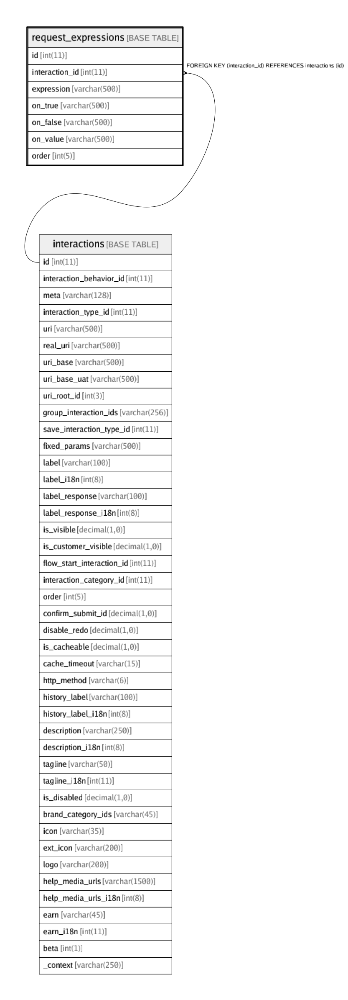

# request_expressions

## Description

Use mathematical expressions using values of other parameters to calculate visibility, enable/disable or new value of other parameters

<details>
<summary><strong>Table Definition</strong></summary>

```sql
CREATE TABLE `request_expressions` (
  `id` int(11) NOT NULL AUTO_INCREMENT,
  `interaction_id` int(11) NOT NULL,
  `expression` varchar(500) NOT NULL COMMENT 'Expression to evaluate. example: \n[''&&'', [''=='', ''{a:num}'', ''{b}''], [''<'', ''{a}'', ''{c}'']]\n(I.e, (a == b and a < c)) Evaluates to true/false.\nAlso, treat ''a'' as a number (without quotes)',
  `on_true` varchar(500) NOT NULL DEFAULT '' COMMENT 'Dependent parameters to update if the expression value evaluates to true\n[\n	{"name":"<param_name>", "visibility":1, "value":"{{}}"}\n]\nHere, {{}}, if used,  is replaced by value of the expression',
  `on_false` varchar(500) NOT NULL DEFAULT '' COMMENT 'Dependent parameters to update if the expression value evaluates to false\n[\n	{"name":"<param_name>", "visibility":1, "value":"{{}}"}\n]\nHere, {{}}, if used,  is replaced by value of the expression',
  `on_value` varchar(500) NOT NULL DEFAULT '' COMMENT 'Dependent parameters to update, whatever the expression value evaluates to\n[\n	{"name":"<param_name>", "visibility":1, "value":"{{}}"}\n]\nHere, {{}}, if used,  is replaced by value of the expression',
  `order` int(5) NOT NULL DEFAULT '0' COMMENT 'Order of execution of expressions for that interaction.',
  PRIMARY KEY (`id`),
  KEY `fk_request_expressions_interaction_id_idx` (`interaction_id`),
  CONSTRAINT `fk_request_expressions_interaction_id` FOREIGN KEY (`interaction_id`) REFERENCES `interactions` (`id`) ON DELETE CASCADE ON UPDATE CASCADE
) ENGINE=InnoDB AUTO_INCREMENT=102 DEFAULT CHARSET=latin1 COMMENT='Use mathematical expressions using values of other parameters to calculate visibility, enable/disable or new value of other parameters'
```

</details>

## Columns

| Name | Type | Default | Nullable | Children | Parents | Comment |
| ---- | ---- | ------- | -------- | -------- | ------- | ------- |
| id | int(11) |  | false |  |  |  |
| interaction_id | int(11) |  | false |  | [interactions](interactions.md) |  |
| expression | varchar(500) |  | false |  |  | Expression to evaluate. example: <br>['&&', ['==', '{a:num}', '{b}'], ['<', '{a}', '{c}']]<br>(I.e, (a == b and a < c)) Evaluates to true/false.<br>Also, treat 'a' as a number (without quotes) |
| on_true | varchar(500) |  | false |  |  | Dependent parameters to update if the expression value evaluates to true<br>[<br>	{"name":"<param_name>", "visibility":1, "value":"{{}}"}<br>]<br>Here, {{}}, if used,  is replaced by value of the expression |
| on_false | varchar(500) |  | false |  |  | Dependent parameters to update if the expression value evaluates to false<br>[<br>	{"name":"<param_name>", "visibility":1, "value":"{{}}"}<br>]<br>Here, {{}}, if used,  is replaced by value of the expression |
| on_value | varchar(500) |  | false |  |  | Dependent parameters to update, whatever the expression value evaluates to<br>[<br>	{"name":"<param_name>", "visibility":1, "value":"{{}}"}<br>]<br>Here, {{}}, if used,  is replaced by value of the expression |
| order | int(5) | 0 | false |  |  | Order of execution of expressions for that interaction. |

## Constraints

| Name | Type | Definition |
| ---- | ---- | ---------- |
| fk_request_expressions_interaction_id | FOREIGN KEY | FOREIGN KEY (interaction_id) REFERENCES interactions (id) |
| PRIMARY | PRIMARY KEY | PRIMARY KEY (id) |

## Indexes

| Name | Definition |
| ---- | ---------- |
| fk_request_expressions_interaction_id_idx | KEY fk_request_expressions_interaction_id_idx (interaction_id) USING BTREE |
| PRIMARY | PRIMARY KEY (id) USING BTREE |

## Relations



---

> Generated by [tbls](https://github.com/k1LoW/tbls)
