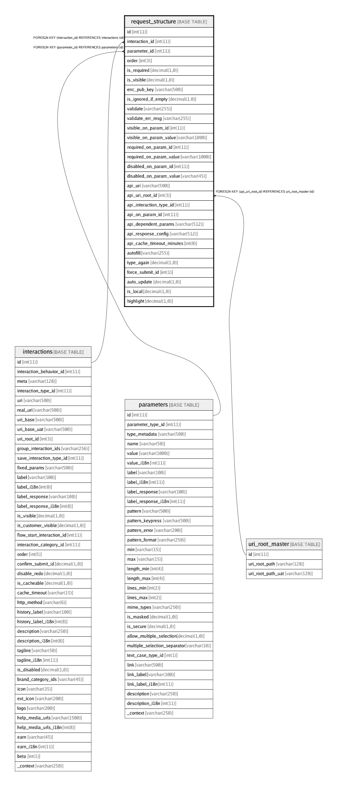

# request_structure

## Description

<details>
<summary><strong>Table Definition</strong></summary>

```sql
CREATE TABLE `request_structure` (
  `id` int(11) NOT NULL AUTO_INCREMENT,
  `interaction_id` int(11) NOT NULL,
  `parameter_id` int(11) NOT NULL,
  `order` int(3) DEFAULT NULL COMMENT 'Order number in which the request parameters should be displayed',
  `is_required` decimal(1,0) NOT NULL DEFAULT '1' COMMENT 'Is it mandatory to provide a value for this field?',
  `is_visible` decimal(1,0) NOT NULL DEFAULT '1' COMMENT 'Is the item visible (active) by default? The value is submitted (sent to the server) only if it is visible (active). ',
  `enc_pub_key` varchar(500) DEFAULT NULL,
  `is_ignored_if_empty` decimal(1,0) NOT NULL DEFAULT '0' COMMENT 'Do not send the parameter in HTTP request if the value is empty',
  `validate` varchar(255) NOT NULL DEFAULT '' COMMENT 'Custom validation expression. Use {} for current field''s value. Use {param-name} to use another parameter''s value.\nSupports LISP like notation in JSON ARRAY format. First item in array is function name and next items are the operands.\nEg: (this-field>amount && this-field<=max_amount) will be written as: [''&&'',  [''>'',{},{amount}], [''<='',{},{max_amount}]]',
  `validate_err_msg` varchar(255) NOT NULL DEFAULT '' COMMENT 'Error message to show when the validation fails',
  `visible_on_param_id` int(11) NOT NULL DEFAULT '0' COMMENT 'id of PARAMETER on which the visibility of this PARAMETER depends',
  `visible_on_param_value` varchar(1000) NOT NULL DEFAULT '' COMMENT 'value of PARAMETER on which the visibility of this PARAMETER depends',
  `required_on_param_id` int(11) NOT NULL DEFAULT '0' COMMENT 'id of PARAMETER on which the optionality of this PARAMETER depends',
  `required_on_param_value` varchar(1000) NOT NULL DEFAULT '' COMMENT 'value of PARAMETER on which the optionality of this PARAMETER depends',
  `disabled_on_param_id` int(11) NOT NULL DEFAULT '0' COMMENT 'id of PARAMETER based on which this PARAMETER is enabled/disabled',
  `disabled_on_param_value` varchar(45) NOT NULL DEFAULT '' COMMENT 'value of PARAMETER based on which this PARAMETER is enabled/disabled',
  `api_uri` varchar(500) NOT NULL DEFAULT '',
  `api_uri_root_id` int(3) NOT NULL DEFAULT '0',
  `api_interaction_type_id` int(11) NOT NULL DEFAULT '0' COMMENT 'interaction_type_id for making a API call to modify this field in real time',
  `api_on_param_id` int(11) NOT NULL DEFAULT '0' COMMENT 'id of PARAMETER on which the API call depends. API is called every time that parameter changes',
  `api_dependent_params` varchar(512) NOT NULL DEFAULT '' COMMENT 'Structure to define dependent parameters, map current parameter name with API parameter name and define constraints. Eg:\n{\n  "utility_acc_no": {                                            // Call this API if utility_acc_no changes\n        "api_param_name":"mobile_number",        // Send value of utility_acc_no as mobile_number to the API (map utility_acc_no to mobile_number)\n        "length_max":4,                                         // Do not call API if length of utility_acc_no > 4\n        "length_min":4                                           // Do not call API if length of utility_acc_no < 4\n  },\n\n  "service_type":{}                                             // Also call API if service_type changes. No mapping or constraints\n}',
  `api_response_config` varchar(512) NOT NULL DEFAULT '' COMMENT 'Structure to define response data: Pass param from response datastructure as a metadata (value, etc) of another parameter.\nEg: [{"name":"data.minimum_length","targetName":"amount","property":"length_min"},{"name":"data.split_msg"}]\n"property" defaults to "value" and "targetName" defaults to the leaf node of "name". Eg: for "data.split_msg", targetName = split_msg',
  `api_cache_timeout_minutes` int(8) NOT NULL DEFAULT '0' COMMENT 'If API response is cached, new API request will not be made for the duration of cache-timeout.\nZero or negetive number: No Cache\nPositive number: Cache in minutes',
  `autofill` varchar(255) NOT NULL DEFAULT '' COMMENT 'Comma separated list of values to show as autofill. Eg: "1000,2000,5000" for amount field.',
  `type_again` decimal(1,0) NOT NULL DEFAULT '0' COMMENT 'Type the number/text input again to confirm?',
  `force_submit_id` int(1) NOT NULL DEFAULT '0' COMMENT '0 = Default / Ignore this flag\n1 = Yes. Force submit even the hidden fields\n2 = No. Don''t submit even visible / chained parameters',
  `auto_update` decimal(1,0) NOT NULL DEFAULT '0' COMMENT 'Automatically update this request-parameter if a data by the same name is sent by server ',
  `is_local` decimal(1,0) NOT NULL DEFAULT '0' COMMENT 'Local parameter. Do not send to server in API calls.',
  `highlight` decimal(1,0) NOT NULL DEFAULT '0' COMMENT 'Should the parameter be highlighted? Show/hide in preview?\n0: Default, 1: Yes (High Priority), 2: No (Low Priority)',
  PRIMARY KEY (`id`),
  KEY `fk_request_parameter_interaction_id_index` (`interaction_id`),
  KEY `fk_request_parameter_id_index` (`parameter_id`),
  KEY `fk_api_uri_root_id` (`api_uri_root_id`),
  CONSTRAINT `fk_api_uri_root_id` FOREIGN KEY (`api_uri_root_id`) REFERENCES `uri_root_master` (`id`),
  CONSTRAINT `fk_request_parameter_id` FOREIGN KEY (`parameter_id`) REFERENCES `parameters` (`id`) ON DELETE CASCADE ON UPDATE CASCADE,
  CONSTRAINT `fk_request_parameter_interaction_id` FOREIGN KEY (`interaction_id`) REFERENCES `interactions` (`id`) ON DELETE CASCADE ON UPDATE CASCADE
) ENGINE=InnoDB AUTO_INCREMENT=3079 DEFAULT CHARSET=latin1
```

</details>

## Columns

| Name | Type | Default | Nullable | Children | Parents | Comment |
| ---- | ---- | ------- | -------- | -------- | ------- | ------- |
| id | int(11) |  | false |  |  |  |
| interaction_id | int(11) |  | false |  | [interactions](interactions.md) |  |
| parameter_id | int(11) |  | false |  | [parameters](parameters.md) |  |
| order | int(3) |  | true |  |  | Order number in which the request parameters should be displayed |
| is_required | decimal(1,0) | 1 | false |  |  | Is it mandatory to provide a value for this field? |
| is_visible | decimal(1,0) | 1 | false |  |  | Is the item visible (active) by default? The value is submitted (sent to the server) only if it is visible (active).  |
| enc_pub_key | varchar(500) |  | true |  |  |  |
| is_ignored_if_empty | decimal(1,0) | 0 | false |  |  | Do not send the parameter in HTTP request if the value is empty |
| validate | varchar(255) |  | false |  |  | Custom validation expression. Use {} for current field's value. Use {param-name} to use another parameter's value.<br>Supports LISP like notation in JSON ARRAY format. First item in array is function name and next items are the operands.<br>Eg: (this-field>amount && this-field<=max_amount) will be written as: ['&&',  ['>',{},{amount}], ['<=',{},{max_amount}]] |
| validate_err_msg | varchar(255) |  | false |  |  | Error message to show when the validation fails |
| visible_on_param_id | int(11) | 0 | false |  |  | id of PARAMETER on which the visibility of this PARAMETER depends |
| visible_on_param_value | varchar(1000) |  | false |  |  | value of PARAMETER on which the visibility of this PARAMETER depends |
| required_on_param_id | int(11) | 0 | false |  |  | id of PARAMETER on which the optionality of this PARAMETER depends |
| required_on_param_value | varchar(1000) |  | false |  |  | value of PARAMETER on which the optionality of this PARAMETER depends |
| disabled_on_param_id | int(11) | 0 | false |  |  | id of PARAMETER based on which this PARAMETER is enabled/disabled |
| disabled_on_param_value | varchar(45) |  | false |  |  | value of PARAMETER based on which this PARAMETER is enabled/disabled |
| api_uri | varchar(500) |  | false |  |  |  |
| api_uri_root_id | int(3) | 0 | false |  | [uri_root_master](uri_root_master.md) |  |
| api_interaction_type_id | int(11) | 0 | false |  |  | interaction_type_id for making a API call to modify this field in real time |
| api_on_param_id | int(11) | 0 | false |  |  | id of PARAMETER on which the API call depends. API is called every time that parameter changes |
| api_dependent_params | varchar(512) |  | false |  |  | Structure to define dependent parameters, map current parameter name with API parameter name and define constraints. Eg:<br>{<br>  "utility_acc_no": {                                            // Call this API if utility_acc_no changes<br>        "api_param_name":"mobile_number",        // Send value of utility_acc_no as mobile_number to the API (map utility_acc_no to mobile_number)<br>        "length_max":4,                                         // Do not call API if length of utility_acc_no > 4<br>        "length_min":4                                           // Do not call API if length of utility_acc_no < 4<br>  },<br><br>  "service_type":{}                                             // Also call API if service_type changes. No mapping or constraints<br>} |
| api_response_config | varchar(512) |  | false |  |  | Structure to define response data: Pass param from response datastructure as a metadata (value, etc) of another parameter.<br>Eg: [{"name":"data.minimum_length","targetName":"amount","property":"length_min"},{"name":"data.split_msg"}]<br>"property" defaults to "value" and "targetName" defaults to the leaf node of "name". Eg: for "data.split_msg", targetName = split_msg |
| api_cache_timeout_minutes | int(8) | 0 | false |  |  | If API response is cached, new API request will not be made for the duration of cache-timeout.<br>Zero or negetive number: No Cache<br>Positive number: Cache in minutes |
| autofill | varchar(255) |  | false |  |  | Comma separated list of values to show as autofill. Eg: "1000,2000,5000" for amount field. |
| type_again | decimal(1,0) | 0 | false |  |  | Type the number/text input again to confirm? |
| force_submit_id | int(1) | 0 | false |  |  | 0 = Default / Ignore this flag<br>1 = Yes. Force submit even the hidden fields<br>2 = No. Don't submit even visible / chained parameters |
| auto_update | decimal(1,0) | 0 | false |  |  | Automatically update this request-parameter if a data by the same name is sent by server  |
| is_local | decimal(1,0) | 0 | false |  |  | Local parameter. Do not send to server in API calls. |
| highlight | decimal(1,0) | 0 | false |  |  | Should the parameter be highlighted? Show/hide in preview?<br>0: Default, 1: Yes (High Priority), 2: No (Low Priority) |

## Constraints

| Name | Type | Definition |
| ---- | ---- | ---------- |
| fk_api_uri_root_id | FOREIGN KEY | FOREIGN KEY (api_uri_root_id) REFERENCES uri_root_master (id) |
| fk_request_parameter_id | FOREIGN KEY | FOREIGN KEY (parameter_id) REFERENCES parameters (id) |
| fk_request_parameter_interaction_id | FOREIGN KEY | FOREIGN KEY (interaction_id) REFERENCES interactions (id) |
| PRIMARY | PRIMARY KEY | PRIMARY KEY (id) |

## Indexes

| Name | Definition |
| ---- | ---------- |
| fk_api_uri_root_id | KEY fk_api_uri_root_id (api_uri_root_id) USING BTREE |
| fk_request_parameter_id_index | KEY fk_request_parameter_id_index (parameter_id) USING BTREE |
| fk_request_parameter_interaction_id_index | KEY fk_request_parameter_interaction_id_index (interaction_id) USING BTREE |
| PRIMARY | PRIMARY KEY (id) USING BTREE |

## Relations



---

> Generated by [tbls](https://github.com/k1LoW/tbls)
