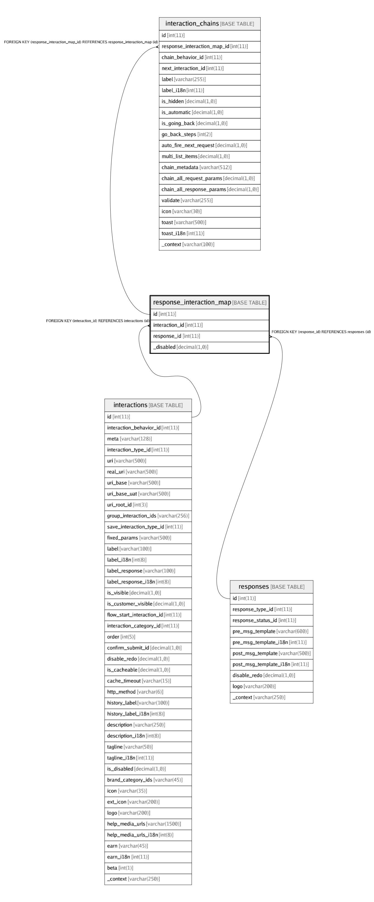

# response_interaction_map

## Description

<details>
<summary><strong>Table Definition</strong></summary>

```sql
CREATE TABLE `response_interaction_map` (
  `id` int(11) NOT NULL AUTO_INCREMENT,
  `interaction_id` int(11) NOT NULL,
  `response_id` int(11) NOT NULL,
  `_disabled` decimal(1,0) NOT NULL DEFAULT '0' COMMENT 'Disable this entry',
  PRIMARY KEY (`id`),
  UNIQUE KEY `index_unique_map` (`interaction_id`,`response_id`),
  KEY `fk_response_interaction_map_interaction_id_idx` (`interaction_id`),
  KEY `fk_response_interaction_map_response_id_idx` (`response_id`),
  CONSTRAINT `fk_response_interaction_map_interaction_id` FOREIGN KEY (`interaction_id`) REFERENCES `interactions` (`id`) ON DELETE CASCADE ON UPDATE CASCADE,
  CONSTRAINT `fk_response_interaction_map_response_id` FOREIGN KEY (`response_id`) REFERENCES `responses` (`id`) ON DELETE CASCADE ON UPDATE CASCADE
) ENGINE=InnoDB AUTO_INCREMENT=880 DEFAULT CHARSET=latin1
```

</details>

## Columns

| Name | Type | Default | Nullable | Children | Parents | Comment |
| ---- | ---- | ------- | -------- | -------- | ------- | ------- |
| id | int(11) |  | false | [interaction_chains](interaction_chains.md) |  |  |
| interaction_id | int(11) |  | false |  | [interactions](interactions.md) |  |
| response_id | int(11) |  | false |  | [responses](responses.md) |  |
| _disabled | decimal(1,0) | 0 | false |  |  | Disable this entry |

## Constraints

| Name | Type | Definition |
| ---- | ---- | ---------- |
| fk_response_interaction_map_interaction_id | FOREIGN KEY | FOREIGN KEY (interaction_id) REFERENCES interactions (id) |
| fk_response_interaction_map_response_id | FOREIGN KEY | FOREIGN KEY (response_id) REFERENCES responses (id) |
| index_unique_map | UNIQUE | UNIQUE KEY index_unique_map (interaction_id, response_id) |
| PRIMARY | PRIMARY KEY | PRIMARY KEY (id) |

## Indexes

| Name | Definition |
| ---- | ---------- |
| fk_response_interaction_map_interaction_id_idx | KEY fk_response_interaction_map_interaction_id_idx (interaction_id) USING BTREE |
| fk_response_interaction_map_response_id_idx | KEY fk_response_interaction_map_response_id_idx (response_id) USING BTREE |
| PRIMARY | PRIMARY KEY (id) USING BTREE |
| index_unique_map | UNIQUE KEY index_unique_map (interaction_id, response_id) USING BTREE |

## Relations



---

> Generated by [tbls](https://github.com/k1LoW/tbls)
