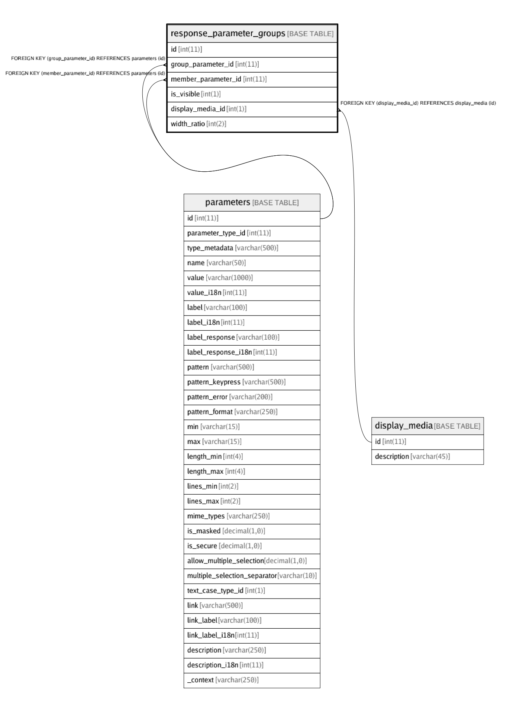

# response_parameter_groups

## Description

<details>
<summary><strong>Table Definition</strong></summary>

```sql
CREATE TABLE `response_parameter_groups` (
  `id` int(11) NOT NULL AUTO_INCREMENT,
  `group_parameter_id` int(11) NOT NULL,
  `member_parameter_id` int(11) NOT NULL,
  `is_visible` int(1) NOT NULL DEFAULT '1',
  `display_media_id` int(1) NOT NULL DEFAULT '0',
  `width_ratio` int(2) NOT NULL DEFAULT '1' COMMENT 'width-ratio = 1 ... 12\nIndicates how total width shhould be divided between the parameters of the group.\nEg:If all parameters have width-ratio=1, they get equal space. If one param has width-ratio=2, it gets twice as much space/width as others.',
  PRIMARY KEY (`id`),
  KEY `fk_response_parameter_groups_group_param_id_idx` (`group_parameter_id`),
  KEY `fk_response_parameter_groups_member_param_id_idx` (`member_parameter_id`),
  KEY `fk_response_parameter_groups_display_media_id_idx` (`display_media_id`),
  CONSTRAINT `fk_response_parameter_groups_display_media_id` FOREIGN KEY (`display_media_id`) REFERENCES `display_media` (`id`) ON DELETE CASCADE ON UPDATE CASCADE,
  CONSTRAINT `fk_response_parameter_groups_group_param_id` FOREIGN KEY (`group_parameter_id`) REFERENCES `parameters` (`id`) ON DELETE CASCADE ON UPDATE CASCADE,
  CONSTRAINT `fk_response_parameter_groups_member_param_id` FOREIGN KEY (`member_parameter_id`) REFERENCES `parameters` (`id`) ON DELETE CASCADE ON UPDATE CASCADE
) ENGINE=InnoDB AUTO_INCREMENT=468 DEFAULT CHARSET=latin1
```

</details>

## Columns

| Name | Type | Default | Nullable | Children | Parents | Comment |
| ---- | ---- | ------- | -------- | -------- | ------- | ------- |
| id | int(11) |  | false |  |  |  |
| group_parameter_id | int(11) |  | false |  | [parameters](parameters.md) |  |
| member_parameter_id | int(11) |  | false |  | [parameters](parameters.md) |  |
| is_visible | int(1) | 1 | false |  |  |  |
| display_media_id | int(1) | 0 | false |  | [display_media](display_media.md) |  |
| width_ratio | int(2) | 1 | false |  |  | width-ratio = 1 ... 12<br>Indicates how total width shhould be divided between the parameters of the group.<br>Eg:If all parameters have width-ratio=1, they get equal space. If one param has width-ratio=2, it gets twice as much space/width as others. |

## Constraints

| Name | Type | Definition |
| ---- | ---- | ---------- |
| fk_response_parameter_groups_display_media_id | FOREIGN KEY | FOREIGN KEY (display_media_id) REFERENCES display_media (id) |
| fk_response_parameter_groups_group_param_id | FOREIGN KEY | FOREIGN KEY (group_parameter_id) REFERENCES parameters (id) |
| fk_response_parameter_groups_member_param_id | FOREIGN KEY | FOREIGN KEY (member_parameter_id) REFERENCES parameters (id) |
| PRIMARY | PRIMARY KEY | PRIMARY KEY (id) |

## Indexes

| Name | Definition |
| ---- | ---------- |
| fk_response_parameter_groups_display_media_id_idx | KEY fk_response_parameter_groups_display_media_id_idx (display_media_id) USING BTREE |
| fk_response_parameter_groups_group_param_id_idx | KEY fk_response_parameter_groups_group_param_id_idx (group_parameter_id) USING BTREE |
| fk_response_parameter_groups_member_param_id_idx | KEY fk_response_parameter_groups_member_param_id_idx (member_parameter_id) USING BTREE |
| PRIMARY | PRIMARY KEY (id) USING BTREE |

## Relations



---

> Generated by [tbls](https://github.com/k1LoW/tbls)
