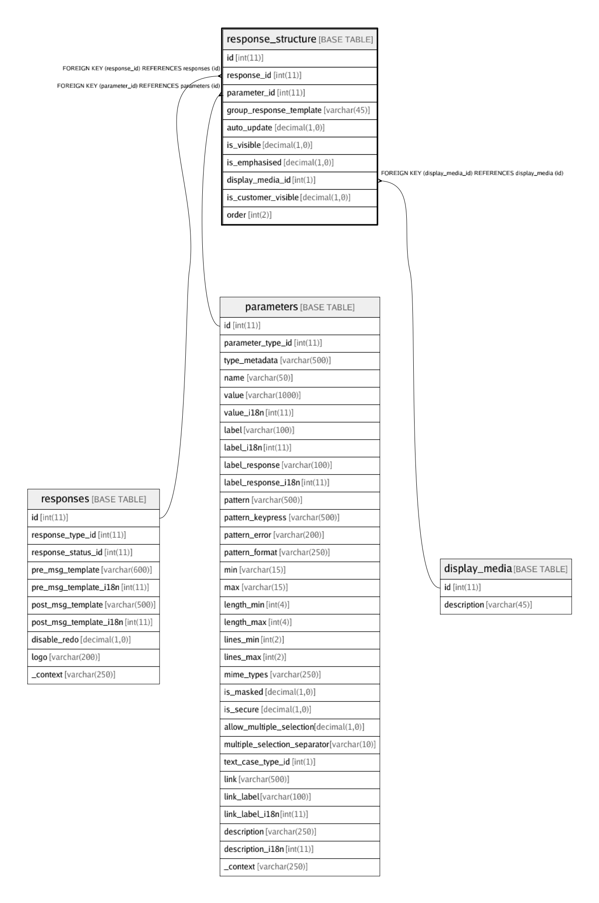

# response_structure

## Description

<details>
<summary><strong>Table Definition</strong></summary>

```sql
CREATE TABLE `response_structure` (
  `id` int(11) NOT NULL AUTO_INCREMENT,
  `response_id` int(11) NOT NULL,
  `parameter_id` int(11) NOT NULL,
  `group_response_template` varchar(45) DEFAULT NULL COMMENT 'Template to render each repetition of response-group',
  `auto_update` decimal(1,0) NOT NULL DEFAULT '0' COMMENT 'Auto update the value of this parameter whenever a response containing a parameter with the same name is returned anywhere in the interaction-flow.\nEg: Customer balance, wallet-limits, etc.',
  `is_visible` decimal(1,0) NOT NULL DEFAULT '1' COMMENT 'Show response parameter on UI? Use for chaining, if not.',
  `is_emphasised` decimal(1,0) NOT NULL DEFAULT '0' COMMENT 'Emphasise the parameter on UI or show strongly (eg: with bold)',
  `display_media_id` int(1) NOT NULL DEFAULT '0',
  `is_customer_visible` decimal(1,0) DEFAULT NULL COMMENT 'Is the field visible to customers (CustaView)? If NULL, the print visibility setting from the field "display_media_id" is used.',
  `order` int(2) DEFAULT NULL COMMENT 'Order number in which response parameters should be displayed',
  PRIMARY KEY (`id`),
  KEY `fk_response_id_index` (`response_id`),
  KEY `fk_response_parameter_id_index` (`parameter_id`),
  KEY `fk_response_display_media_id_idx` (`display_media_id`),
  CONSTRAINT `fk_response_id` FOREIGN KEY (`response_id`) REFERENCES `responses` (`id`) ON DELETE CASCADE ON UPDATE CASCADE,
  CONSTRAINT `fk_response_parameter_id` FOREIGN KEY (`parameter_id`) REFERENCES `parameters` (`id`) ON DELETE CASCADE ON UPDATE CASCADE,
  CONSTRAINT `fk_response_structure_display_media_id` FOREIGN KEY (`display_media_id`) REFERENCES `display_media` (`id`) ON DELETE CASCADE ON UPDATE CASCADE
) ENGINE=InnoDB AUTO_INCREMENT=979 DEFAULT CHARSET=latin1
```

</details>

## Columns

| Name | Type | Default | Nullable | Children | Parents | Comment |
| ---- | ---- | ------- | -------- | -------- | ------- | ------- |
| id | int(11) |  | false |  |  |  |
| response_id | int(11) |  | false |  | [responses](responses.md) |  |
| parameter_id | int(11) |  | false |  | [parameters](parameters.md) |  |
| group_response_template | varchar(45) |  | true |  |  | Template to render each repetition of response-group |
| auto_update | decimal(1,0) | 0 | false |  |  | Auto update the value of this parameter whenever a response containing a parameter with the same name is returned anywhere in the interaction-flow.<br>Eg: Customer balance, wallet-limits, etc. |
| is_visible | decimal(1,0) | 1 | false |  |  | Show response parameter on UI? Use for chaining, if not. |
| is_emphasised | decimal(1,0) | 0 | false |  |  | Emphasise the parameter on UI or show strongly (eg: with bold) |
| display_media_id | int(1) | 0 | false |  | [display_media](display_media.md) |  |
| is_customer_visible | decimal(1,0) |  | true |  |  | Is the field visible to customers (CustaView)? If NULL, the print visibility setting from the field "display_media_id" is used. |
| order | int(2) |  | true |  |  | Order number in which response parameters should be displayed |

## Constraints

| Name | Type | Definition |
| ---- | ---- | ---------- |
| fk_response_id | FOREIGN KEY | FOREIGN KEY (response_id) REFERENCES responses (id) |
| fk_response_parameter_id | FOREIGN KEY | FOREIGN KEY (parameter_id) REFERENCES parameters (id) |
| fk_response_structure_display_media_id | FOREIGN KEY | FOREIGN KEY (display_media_id) REFERENCES display_media (id) |
| PRIMARY | PRIMARY KEY | PRIMARY KEY (id) |

## Indexes

| Name | Definition |
| ---- | ---------- |
| fk_response_display_media_id_idx | KEY fk_response_display_media_id_idx (display_media_id) USING BTREE |
| fk_response_id_index | KEY fk_response_id_index (response_id) USING BTREE |
| fk_response_parameter_id_index | KEY fk_response_parameter_id_index (parameter_id) USING BTREE |
| PRIMARY | PRIMARY KEY (id) USING BTREE |

## Relations



---

> Generated by [tbls](https://github.com/k1LoW/tbls)
