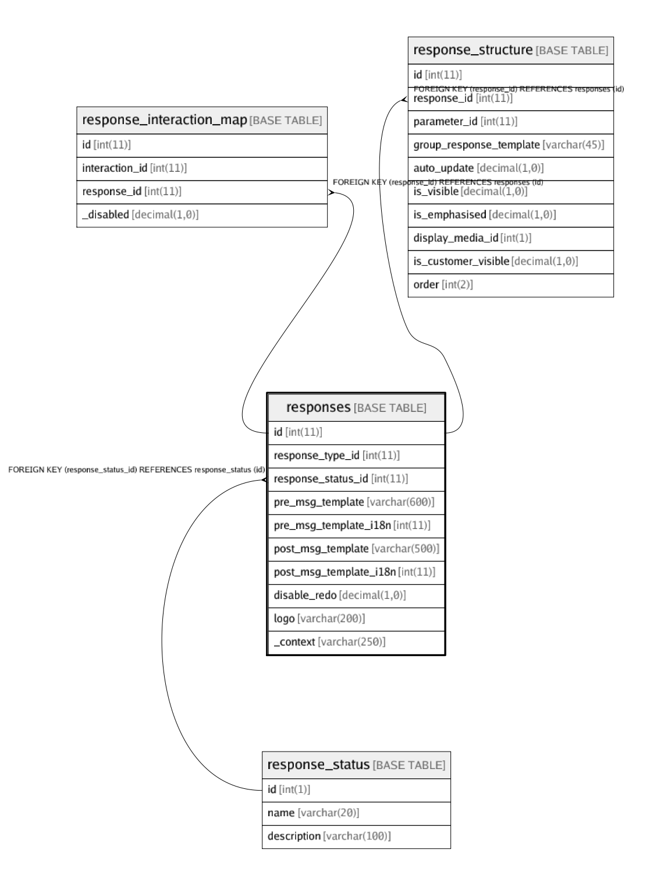

# responses

## Description

<details>
<summary><strong>Table Definition</strong></summary>

```sql
CREATE TABLE `responses` (
  `id` int(11) NOT NULL,
  `response_type_id` int(11) DEFAULT NULL,
  `response_status_id` int(11) DEFAULT '0',
  `pre_msg_template` varchar(600) CHARACTER SET utf8 COLLATE utf8_unicode_ci NOT NULL DEFAULT '',
  `pre_msg_template_i18n` int(11) DEFAULT NULL,
  `post_msg_template` varchar(500) CHARACTER SET utf8 COLLATE utf8_unicode_ci NOT NULL DEFAULT '',
  `post_msg_template_i18n` int(11) DEFAULT NULL,
  `disable_redo` decimal(1,0) NOT NULL DEFAULT '0' COMMENT 'Do not allow user to jump back to this response card by clicking on it (when it is in preview mode)',
  `logo` varchar(200) NOT NULL DEFAULT '' COMMENT 'LOGO / Branding image absolute URI to show on top-right side of response cards. MAX-HEIGHT: 50px',
  `_context` varchar(250) DEFAULT NULL COMMENT 'more info about this response for internal usage',
  PRIMARY KEY (`id`),
  KEY `fk_response_status_id_index` (`response_status_id`),
  KEY `fk_response_type_id_index` (`response_type_id`),
  CONSTRAINT `fk_response_status_id` FOREIGN KEY (`response_status_id`) REFERENCES `response_status` (`id`) ON DELETE CASCADE ON UPDATE CASCADE
) ENGINE=InnoDB DEFAULT CHARSET=latin1
```

</details>

## Columns

| Name | Type | Default | Nullable | Children | Parents | Comment |
| ---- | ---- | ------- | -------- | -------- | ------- | ------- |
| id | int(11) |  | false | [response_interaction_map](response_interaction_map.md) [response_structure](response_structure.md) |  |  |
| response_type_id | int(11) |  | true |  |  |  |
| response_status_id | int(11) | 0 | true |  | [response_status](response_status.md) |  |
| pre_msg_template | varchar(600) |  | false |  |  |  |
| pre_msg_template_i18n | int(11) |  | true |  |  |  |
| post_msg_template | varchar(500) |  | false |  |  |  |
| post_msg_template_i18n | int(11) |  | true |  |  |  |
| disable_redo | decimal(1,0) | 0 | false |  |  | Do not allow user to jump back to this response card by clicking on it (when it is in preview mode) |
| logo | varchar(200) |  | false |  |  | LOGO / Branding image absolute URI to show on top-right side of response cards. MAX-HEIGHT: 50px |
| _context | varchar(250) |  | true |  |  | more info about this response for internal usage |

## Constraints

| Name | Type | Definition |
| ---- | ---- | ---------- |
| fk_response_status_id | FOREIGN KEY | FOREIGN KEY (response_status_id) REFERENCES response_status (id) |
| PRIMARY | PRIMARY KEY | PRIMARY KEY (id) |

## Indexes

| Name | Definition |
| ---- | ---------- |
| fk_response_status_id_index | KEY fk_response_status_id_index (response_status_id) USING BTREE |
| fk_response_type_id_index | KEY fk_response_type_id_index (response_type_id) USING BTREE |
| PRIMARY | PRIMARY KEY (id) USING BTREE |

## Relations



---

> Generated by [tbls](https://github.com/k1LoW/tbls)
